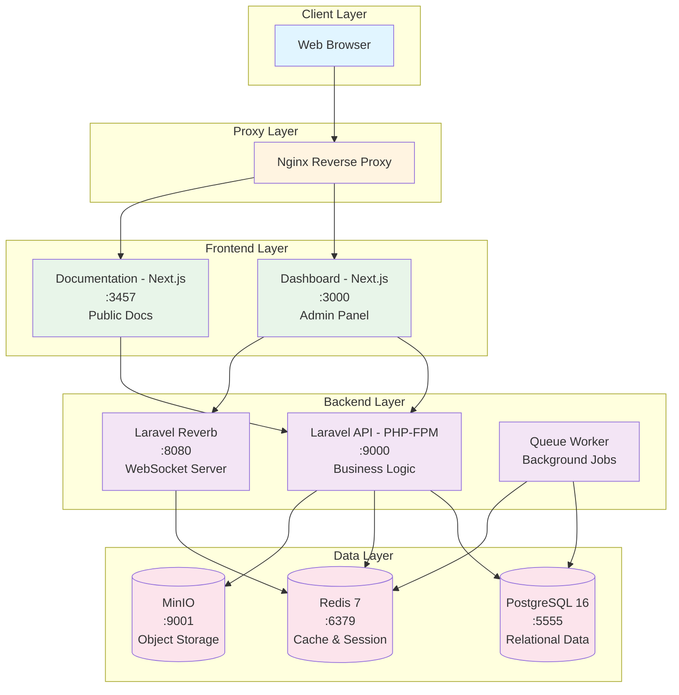
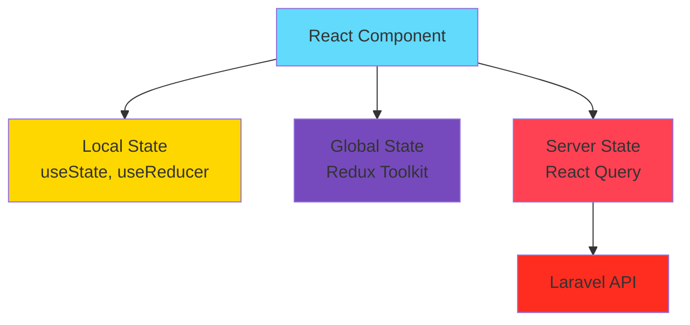
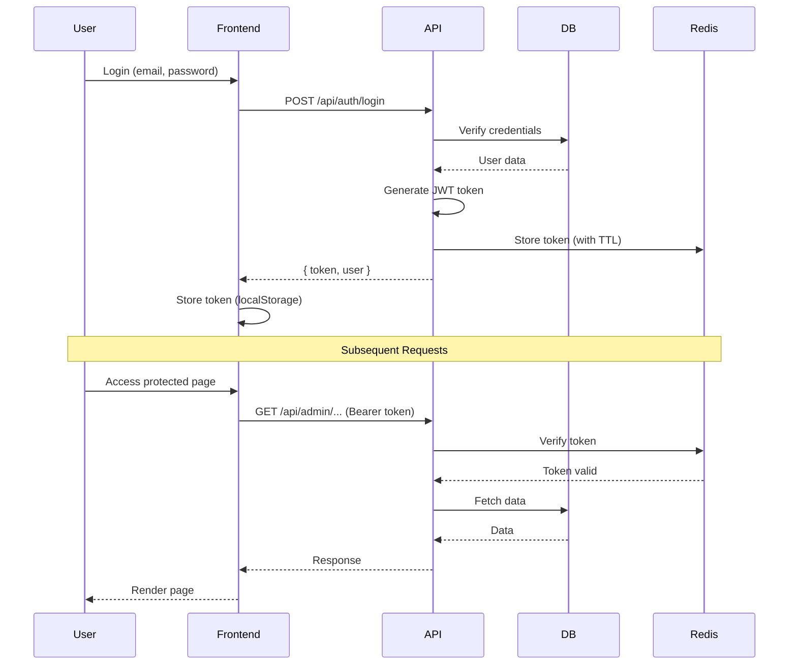

# 02. Kiến Trúc Hệ Thống - System Architecture

> Kiến trúc chi tiết của hệ thống Second Memory PKMS

---

## 📐 Tổng quan Kiến trúc

Second Memory được thiết kế theo mô hình **Microservices trong Docker Container**, với sự phân tách rõ ràng giữa các concerns (Frontend, Backend, Data, Cache, Storage).

### Nguyên tắc Thiết kế

1. **Separation of Concerns**: Tách biệt hoàn toàn giữa Presentation, Business Logic và Data
2. **Container-based**: Mọi service đều chạy trong Docker container độc lập
3. **Stateless Application**: Application layer không lưu state, mọi state đều ở Data layer
4. **API-first**: Backend expose RESTful API, Frontend consume API
5. **Event-driven**: Sử dụng Queue và WebSocket cho async operations

---

## 🏛️ Kiến trúc Tổng quan (High-level Architecture)

### Sơ đồ Kiến trúc



---

## 🔄 Luồng Dữ liệu (Data Flow)

### 1. User Request Flow (Synchronous)

```
User → Browser → Nginx → Dashboard/Docs → API (Laravel) → Database/Cache → Response
```

**Chi tiết từng bước**:

1. **User gửi request** từ browser (HTTP/HTTPS)
2. **Nginx** nhận request và route đến service phù hợp:
   - `/admin/*` → Dashboard (:3000)
   - `/docs/*` → Documentation (:3457)
   - `/api/*` → Laravel API (:9000)
3. **Frontend (Next.js)** render page hoặc gọi API
4. **Laravel API** xử lý business logic:
   - Check cache (Redis) trước
   - Nếu miss cache → query Database (PostgreSQL)
   - Update cache nếu cần
5. **Response** trả về qua cùng đường đi ngược lại

### 2. File Upload Flow

```
User Upload → Dashboard → API → MinIO → Database (metadata)
```

**Chi tiết**:

1. User chọn file từ Dashboard
2. File được upload lên Laravel API (multipart/form-data)
3. Laravel validate và process file
4. File được lưu vào **MinIO bucket** (S3-compatible storage)
5. Metadata (filename, size, path, type) lưu vào **PostgreSQL**
6. Return presigned URL cho client

### 3. Background Job Flow (Asynchronous)

```
API Dispatch Job → Redis Queue → Queue Worker → Process → Update Database
```

**Use cases**:
- Send email notifications
- Process large files
- Generate reports
- Cleanup old data
- Sync data to external services

### 4. Real-time Update Flow (WebSocket)

```
Client Subscribe → Reverb (WebSocket) → Redis Pub/Sub → Broadcast → All Connected Clients
```

**Use cases**:
- Live content updates
- Collaborative editing
- Notification push
- System status updates

---

## 🐳 Docker Architecture

### Container Orchestration

File: `docker/docker-compose.yml`

```yaml
services:
  ml-postgres:     # PostgreSQL 16
  ml-redis:        # Redis 7
  ml-php:          # PHP-FPM + Laravel
  ml-reverb:       # Laravel Reverb (WebSocket)
  ml-queue:        # Laravel Queue Worker
  ml-minio:        # MinIO Object Storage
  ml-minio-init:   # MinIO bucket initialization
  ml-nextjs:       # Next.js Dashboard (development)
  ml-nextjs-docs:  # Next.js Documentation (development)
```

### Dependency Graph

```mermaid
graph LR
    Postgres[ml-postgres]
    Redis[ml-redis]
    MinIO[ml-minio]
    MinIOInit[ml-minio-init]
    PHP[ml-php]
    Reverb[ml-reverb]
    Queue[ml-queue]
    NextJS[ml-nextjs]
    NextDocs[ml-nextjs-docs]
    
    MinIO --> MinIOInit
    Postgres --> PHP
    Redis --> PHP
    MinIOInit --> PHP
    PHP --> Reverb
    PHP --> Queue
    PHP --> NextJS
    PHP --> NextDocs
    
    style Postgres fill:#336791
    style Redis fill:#DC382D
    style MinIO fill:#C72E49
    style PHP fill:#777BB4
    style NextJS fill:#000000
```



**Healthchecks**:
- PostgreSQL: `pg_isready`
- Redis: `redis-cli ping`
- PHP-FPM: `php-fpm -t`
- MinIO: `mc ready`

---

## 🏗️ Application Architecture (Laravel)

### Layered Architecture

```
┌─────────────────────────────────────────────┐
│           HTTP Layer (Routes)               │
│         routes/api.php, web.php             │
└─────────────────┬───────────────────────────┘
                  │
┌─────────────────▼───────────────────────────┐
│        Controller Layer                     │
│     app/Http/Controllers/*                  │
│  - Validate request                         │
│  - Call service layer                       │
│  - Format response                          │
└─────────────────┬───────────────────────────┘
                  │
┌─────────────────▼───────────────────────────┐
│         Service Layer                       │
│       app/Services/*                        │
│  - Business Logic                           │
│  - Orchestrate repositories                 │
│  - Handle transactions                      │
└─────────────────┬───────────────────────────┘
                  │
┌─────────────────▼───────────────────────────┐
│      Repository Layer                       │
│     app/Repositories/*                      │
│  - Data access abstraction                  │
│  - Query building                           │
│  - Cache management                         │
└─────────────────┬───────────────────────────┘
                  │
┌─────────────────▼───────────────────────────┐
│         Model Layer                         │
│        app/Models/*                         │
│  - Eloquent ORM                             │
│  - Relationships                            │
│  - Accessors/Mutators                       │
└─────────────────┬───────────────────────────┘
                  │
┌─────────────────▼───────────────────────────┐
│          Database                           │
│         PostgreSQL                          │
└─────────────────────────────────────────────┘
```

### Supporting Layers

- **Events/Listeners**: `app/Events/`, `app/Listeners/` - Event-driven architecture
- **Jobs**: `app/Jobs/` - Background job processing
- **Observers**: `app/Observers/` - Model lifecycle hooks
- **Middleware**: `app/Http/Middleware/` - Request/Response filtering
- **Exceptions**: `app/Exceptions/` - Error handling
- **Constants/Enums**: `app/Constants/`, `app/Enums/` - Shared values
- **Traits**: `app/Traits/` - Reusable code
- **Utilities**: `app/Utilities/` - Helper functions

---

## 🎨 Frontend Architecture (Next.js)

### App Structure (Next.js 16 App Router)

```
nextjs-fe/
├── src/
│   ├── app/                    # App Router pages
│   │   ├── [locale]/          # Internationalization
│   │   │   ├── layout.tsx     # Root layout
│   │   │   ├── page.tsx       # Home page
│   │   │   └── admin/         # Admin routes
│   │   │       ├── categories/
│   │   │       ├── entries/
│   │   │       └── ...
│   │   └── api/               # API routes (Next.js API)
│   │
│   ├── components/            # Reusable components
│   │   ├── ui/               # UI components (shadcn)
│   │   ├── forms/            # Form components
│   │   ├── layouts/          # Layout components
│   │   └── features/         # Feature-specific
│   │
│   ├── lib/                   # Utilities & config
│   │   ├── api/              # API client (axios)
│   │   ├── hooks/            # Custom hooks
│   │   ├── utils/            # Helper functions
│   │   └── constants/        # Constants
│   │
│   ├── store/                # Redux Toolkit store
│   │   ├── slices/
│   │   └── store.ts
│   │
│   └── styles/               # Global styles
│
└── public/                    # Static assets
```

### State Management Strategy



**Quy tắc sử dụng**:
- **Local State**: UI state (modal open/close, form values, toggle)
- **Redux**: Global UI state (theme, user session, sidebar state)
- **React Query**: Server data (API responses, caching, mutations)

---

## 🔐 Authentication & Authorization Flow

### JWT Authentication Flow



### Authorization Layers

1. **Route-based**: Middleware kiểm tra user role và permissions
2. **Model-based**: Policy classes kiểm tra user có quyền với resource cụ thể
3. **Field-based**: Accessor/Mutator ẩn/hiện field theo quyền

---

## 💾 Caching Strategy

### Multi-level Cache

```
┌─────────────────────────────────────────────┐
│  Level 1: Browser Cache (HTTP Cache)       │
│  - Static assets (CSS, JS, images)         │
│  - Cache-Control headers                   │
└─────────────────────────────────────────────┘
                  │
┌─────────────────▼───────────────────────────┐
│  Level 2: Redis Cache (Application Cache)  │
│  - API responses                            │
│  - Database query results                   │
│  - Session data                             │
│  - TTL: 5-60 minutes                        │
└─────────────────────────────────────────────┘
                  │
┌─────────────────▼───────────────────────────┐
│  Level 3: Database Cache (Query Cache)     │
│  - PostgreSQL query cache                   │
│  - Index usage                              │
└─────────────────────────────────────────────┘
```

**Cache Invalidation Strategy**:
- **Time-based**: TTL expire
- **Event-based**: Model Observer clear cache on update/delete
- **Manual**: Admin can clear cache via dashboard

---

## 📦 Deployment Architecture

### Production Deployment (Planned)

```
┌─────────────────────────────────────────────┐
│              Load Balancer                  │
│            (Nginx / HAProxy)                │
└─────────────┬───────────────────────────────┘
              │
    ┌─────────┴─────────┐
    │                   │
┌───▼────┐        ┌─────▼───┐
│ App 1  │        │  App 2  │
│ Docker │        │ Docker  │
│ Swarm  │        │ Swarm   │
└───┬────┘        └─────┬───┘
    │                   │
    └─────────┬─────────┘
              │
    ┌─────────▼─────────┐
    │  Shared Database  │
    │  PostgreSQL HA    │
    │  (Primary/Replica)│
    └───────────────────┘
```

### Current Development Setup

```
Docker Host (Local Machine)
├── Docker Compose
│   ├── ml-postgres (PostgreSQL)
│   ├── ml-redis (Redis)
│   ├── ml-minio (MinIO)
│   ├── ml-php (Laravel API)
│   ├── ml-reverb (WebSocket)
│   └── ml-queue (Queue Worker)
│
└── pnpm workspace
    ├── nextjs-fe (Dashboard - dev server)
    └── nextjs-docs (Documentation - dev server)
```

---

## 🌐 External Integrations (Current & Planned)

### Current Integrations

| Service | Purpose | Status |
|:--------|:--------|:-------|
| **MinIO** | S3-compatible object storage | ✅ Active |
| **Rclone** | Multi-cloud backup sync | ✅ Active |
| **Google Drive** | Backup destination | ✅ Active |
| **OneDrive** | Backup destination | ✅ Active |

### Planned Integrations

| Service | Purpose | Priority |
|:--------|:--------|:---------|
| **OpenAI API** | LLM for AI features | 🔴 High |
| **Tavily** | Web search for RAG | 🔴 High |
| **ChromaDB/FAISS** | Vector database for embeddings | 🟡 Medium |
| **Elasticsearch** | Full-text search engine | 🟡 Medium |
| **Sentry** | Error tracking & monitoring | 🟢 Low |
| **Google Analytics** | Usage analytics | 🟢 Low |

---

## 📊 Performance & Scalability

### Current Performance Metrics

- **API Response Time**: < 200ms (avg)
- **Page Load Time**: < 1s (avg)
- **Database Query Time**: < 50ms (avg)
- **Cache Hit Rate**: 80%+ (target)

### Scalability Considerations

**Vertical Scaling** (Current approach):
- Increase container resources (CPU, RAM)
- Optimize database queries
- Improve caching strategy

**Horizontal Scaling** (Future):
- Load balancer cho multiple app instances
- Database read replicas
- CDN cho static assets
- Redis Cluster cho distributed cache

---

## 🔒 Security Architecture

### Network Security

```
Internet → Firewall → Nginx (SSL/TLS) → Docker Network (isolated)
```

- **SSL/TLS**: HTTPS-only in production
- **Firewall**: Only expose necessary ports
- **Docker Network**: Internal communication only
- **Environment Variables**: Sensitive configs không commit vào git

### Application Security

- **JWT**: Token-based authentication
- **CORS**: Whitelist allowed origins
- **Rate Limiting**: Prevent abuse
- **SQL Injection**: Eloquent ORM (prepared statements)
- **XSS**: Input sanitization, output escaping
- **CSRF**: Token validation

---

## 📈 Monitoring & Logging

### Logging Strategy

```
Application Logs → Laravel Log (storage/logs/) → Log Rotation
                                                        │
                                                        ▼
                                              Daily log files
                                              (laravel-YYYY-MM-DD.log)
```

**Log Levels**:
- `DEBUG`: Development debugging
- `INFO`: General information
- `WARNING`: Warning messages
- `ERROR`: Error messages
- `CRITICAL`: Critical errors (system failure)

### Monitoring (Planned)

- **Healthcheck Endpoints**: `/api/health`, `/api/status`
- **Database Monitoring**: Query performance, connection pool
- **Cache Monitoring**: Hit/miss ratio, memory usage
- **Queue Monitoring**: Job success/failure rate
- **Resource Monitoring**: CPU, RAM, Disk usage

---

## 🔄 Backup & Disaster Recovery Architecture

Chi tiết đầy đủ xem tại [09. Bảo mật & Backup](./09-security-backup.md)

**High-level flow**:

```
Source Data → Backup Script → Local Archive → Rclone → Cloud Storage
     │                                                        │
     │                                                        │
     └───────────── Restore Script ◄─────────────────────────┘
```

**Components**:
- PostgreSQL dump (Custom format)
- MinIO mirror (mc mirror)
- Environment files (.env)
- Multi-cloud distribution (Google Drive, OneDrive)
- Automatic cleanup (3-day retention)

---

**Cập nhật lần cuối**: 2026-04-09
