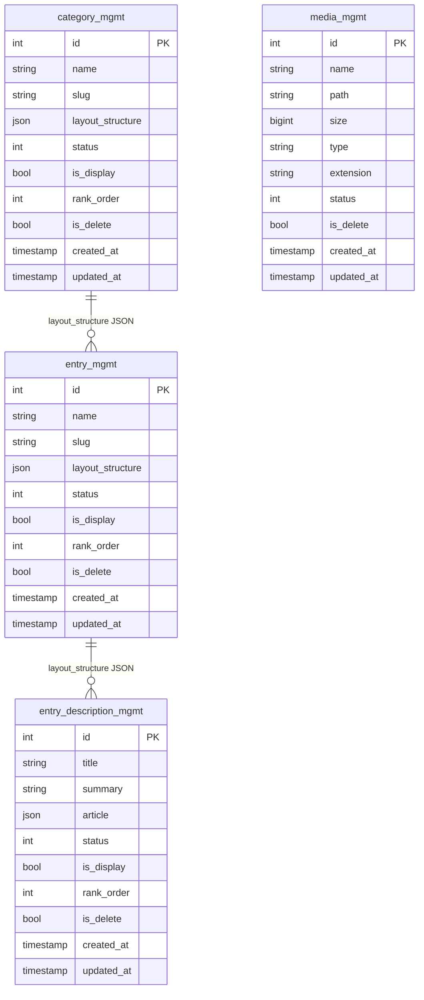
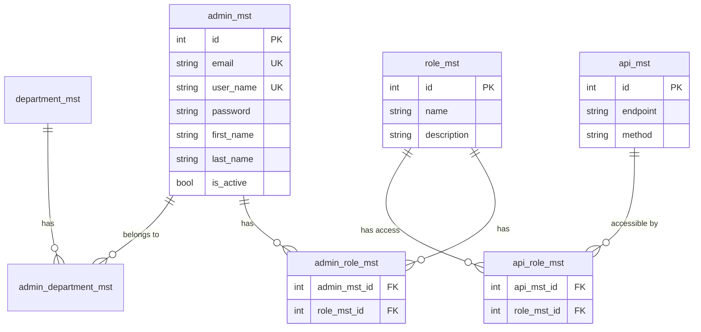

# 04. Thiết Kế Database - Database Design

> Schema database, migrations, relationships và indexing strategy

---

## 📊 Tổng quan Database

### Thông tin Database

- **DBMS**: PostgreSQL 16 Alpine
- **Encoding**: UTF-8
- **Locale**: en_US.UTF-8
- **Connection Pool**: 200 max connections
- **Migration Tool**: Laravel Migrations
- **ORM**: Laravel Eloquent

### Đặc điểm Kiến trúc

✅ **No Foreign Key Constraints**: Sử dụng JSON `layout_structure` để liên kết  
✅ **History Tracking**: Mỗi bảng chính có bảng `_hist` (history) tương ứng  
✅ **Soft Delete**: Sử dụng cột `is_delete` thay vì physical delete  
✅ **JSONB Support**: Lưu trữ flexible data (article, layout_structure)  
✅ **Timestamp Tracking**: Tất cả bảng có `created_at`, `updated_at`  

---

## 🗂️ Database Schema Overview

### Core Tables (Quản lý Nội dung)

| Table | Description | Relationships |
|:------|:------------|:--------------|
| **category_mgmt** | Danh mục (Category) | → entry_mgmt (via JSON) |
| **entry_mgmt** | Đầu mục (Entry/Menu) | → entry_description_mgmt (via JSON) |
| **entry_description_mgmt** | Nội dung chi tiết | - |
| **media_mgmt** | File & Media upload | - |

### History Tables

| Table | Tracks changes of |
|:------|:------------------|
| **category_mgmt_hist** | category_mgmt |
| **entry_mgmt_hist** | entry_mgmt |
| **entry_description_mgmt_hist** | entry_description_mgmt |
| **banner_mgmt_hist** | banner_mgmt |
| **slider_mgmt_hist** | slider_mgmt |
| **social_mgmt_hist** | social_mgmt |
| **setting_link_mgmt_hist** | setting_link_mgmt |
| **user_mgmt_hist** | user_mgmt |

### Authentication & Authorization Tables

| Table | Description |
|:------|:------------|
| **admin_mst** | Admin users |
| **role_mst** | Admin roles (Admin, Editor, Viewer...) |
| **admin_role_mst** | Admin ↔ Role (many-to-many) |
| **feature_mst** | Features/Permissions |
| **department_mst** | Departments |
| **admin_department_mst** | Admin ↔ Department |
| **policy_department_mst** | Policies |
| **policy_department_mst_hist** | Policy history |

### API & Token Management

| Table | Description |
|:------|:------------|
| **api_mst** | API endpoints definition |
| **api_role_mst** | API ↔ Role permissions |
| **token_mst** | JWT tokens |

### Frontend Management

| Table | Description |
|:------|:------------|
| **user_mgmt** | End users (frontend) |
| **banner_mgmt** | Homepage banners |
| **slider_mgmt** | Sliders |
| **social_mgmt** | Social media links |
| **setting_link_mgmt** | System settings |

### System Tables (Laravel)

| Table | Description |
|:------|:------------|
| **users** | Laravel default users |
| **password_reset_tokens** | Password reset |
| **sessions** | User sessions |
| **cache** | Laravel cache |
| **cache_locks** | Cache locks |
| **jobs** | Queue jobs |
| **job_batches** | Job batches |
| **failed_jobs** | Failed jobs |

---

## 📋 Chi tiết Schema các Bảng Chính

### 1. category_mgmt (Danh mục)

```sql
CREATE TABLE category_mgmt (
    id SERIAL PRIMARY KEY,
    name VARCHAR(255) NOT NULL,              -- Tên category
    slug VARCHAR(255) NOT NULL,              -- URL-friendly slug
    description VARCHAR(150),                -- Mô tả ngắn
    layout_structure JSON,                   -- ⭐ JSON quản lý Entry
    status SMALLINT DEFAULT 0,               -- Trạng thái (0=draft, 1=published...)
    is_display BOOLEAN DEFAULT false,        -- Hiển thị hay ẩn
    rank_order SMALLINT DEFAULT 0,           -- Thứ tự sắp xếp
    is_delete BOOLEAN DEFAULT false,         -- Soft delete
    created_at TIMESTAMP,
    updated_at TIMESTAMP
);

CREATE INDEX idx_category_slug ON category_mgmt(slug);
CREATE INDEX idx_category_status_display ON category_mgmt(status, is_display);
```

**layout_structure format**:
```json
[
  {
    "ui_id": "uuid-1234",
    "entry_mgmt_id": 123,
    "name": "Entry Name",
    "slug": "entry-slug",
    "children": [
      {
        "ui_id": "uuid-5678",
        "entry_mgmt_id": 456,
        "name": "Child Entry",
        "slug": "child-slug"
      }
    ]
  }
]
```

**⚠️ Lưu ý**: `layout_structure` là cách DUY NHẤT liên kết Category → Entry (không có FK).

---

### 2. entry_mgmt (Đầu mục / Menu)

```sql
CREATE TABLE entry_mgmt (
    id SERIAL PRIMARY KEY,
    name VARCHAR(255) NOT NULL,              -- Tên entry
    slug VARCHAR(255) NOT NULL,              -- URL slug
    layout_structure JSON,                   -- ⭐ JSON quản lý Entry Description
    status SMALLINT DEFAULT 0,               -- Trạng thái
    is_display BOOLEAN DEFAULT false,        -- Hiển thị
    rank_order SMALLINT DEFAULT 0,           -- Thứ tự
    is_delete BOOLEAN DEFAULT false,         -- Soft delete
    created_at TIMESTAMP,
    updated_at TIMESTAMP
);

CREATE INDEX idx_entry_slug ON entry_mgmt(slug);
CREATE INDEX idx_entry_status_display ON entry_mgmt(status, is_display);
```

**layout_structure format** (khác với Category):
```json
[
  {
    "ui_id": "uuid-abc",
    "entry_desc_id": 10,       // ⚠️ Chú ý: Frontend dùng "entry_desc_id", KHÔNG phải "entry_description_mgmt_id"
    "title": "Entry Description Title",
    "children": [...]           // Hỗ trợ nested tối đa 5 cấp
  }
]
```

---

### 3. entry_description_mgmt (Nội dung)

```sql
CREATE TABLE entry_description_mgmt (
    id SERIAL PRIMARY KEY,
    title VARCHAR(100) NOT NULL,             -- Tiêu đề
    summary VARCHAR(255) NOT NULL,           -- Tóm tắt
    article JSON,                            -- ⭐ Nội dung Tiptap JSON
    status SMALLINT DEFAULT 0,
    is_display BOOLEAN DEFAULT false,
    rank_order SMALLINT DEFAULT 0,
    is_delete BOOLEAN DEFAULT false,
    created_at TIMESTAMP,
    updated_at TIMESTAMP
);

CREATE INDEX idx_entry_desc_status_display ON entry_description_mgmt(status, is_display);
CREATE INDEX idx_entry_desc_title ON entry_description_mgmt USING GIN (to_tsvector('english', title));
```

**article format** (Tiptap JSON):
```json
{
  "type": "doc",
  "content": [
    {
      "type": "heading",
      "attrs": { "level": 1 },
      "content": [{ "type": "text", "text": "Heading 1" }]
    },
    {
      "type": "paragraph",
      "content": [{ "type": "text", "text": "Paragraph content..." }]
    },
    {
      "type": "image",
      "attrs": { "src": "https://...", "alt": "Image" }
    }
  ]
}
```

**⚠️ Lưu ý**: Table này KHÔNG có cột `layout_structure` (đã bị drop).

---

### 4. media_mgmt (File & Media)

```sql
CREATE TABLE media_mgmt (
    id SERIAL PRIMARY KEY,
    name VARCHAR(255) NOT NULL,              -- Tên file gốc
    path VARCHAR(255) NOT NULL,              -- Path trong MinIO
    size BIGINT,                             -- File size (bytes)
    type VARCHAR(50),                        -- MIME type
    extension VARCHAR(10),                   -- File extension
    status SMALLINT DEFAULT 0,               -- Trạng thái (added: 2026-02)
    is_delete BOOLEAN DEFAULT false,
    created_at TIMESTAMP,
    updated_at TIMESTAMP
);

CREATE INDEX idx_media_type ON media_mgmt(type);
CREATE INDEX idx_media_created_at ON media_mgmt(created_at DESC);
```

**MinIO Storage Structure**:
```
bucket: second-memory
├── images/
│   ├── 2026/04/09/uuid-image.jpg
│   └── ...
├── documents/
│   └── ...
└── videos/
    └── ...
```

---

### 5. admin_mst (Admin Users)

```sql
CREATE TABLE admin_mst (
    id SERIAL PRIMARY KEY,
    email VARCHAR(30) UNIQUE NOT NULL,
    user_name VARCHAR(50) UNIQUE NOT NULL,
    password VARCHAR(100) NOT NULL,
    first_name VARCHAR(20) NOT NULL,
    last_name VARCHAR(20) NOT NULL,
    address VARCHAR(100),
    phone_number VARCHAR(20),
    birth TIMESTAMP,
    gender SMALLINT DEFAULT 0,               -- 0=other, 1=male, 2=female
    status SMALLINT DEFAULT 0,
    is_active BOOLEAN DEFAULT false,
    avatar VARCHAR(30),
    email_verified_at TIMESTAMP,
    is_delete BOOLEAN DEFAULT false,
    limit_access INT DEFAULT 0,              -- Lock after 5 failed logins
    remember_token VARCHAR(100),
    created_at TIMESTAMP,
    updated_at TIMESTAMP
);

CREATE INDEX idx_admin_email ON admin_mst(email);
CREATE INDEX idx_admin_username ON admin_mst(user_name);
CREATE INDEX idx_admin_status_active ON admin_mst(status, is_active);
```

---

## 🔗 Entity Relationship Diagram (ERD)

### Mô hình Dữ liệu Core



### Authentication & Authorization Model



---

## 📇 Indexing Strategy

### Primary Indexes

Tất cả bảng đều có **Primary Key** trên cột `id` (auto-increment).

### Secondary Indexes

#### Content Management Tables

```sql
-- category_mgmt
CREATE INDEX idx_category_slug ON category_mgmt(slug);
CREATE INDEX idx_category_status_display ON category_mgmt(status, is_display) WHERE is_delete = false;

-- entry_mgmt
CREATE INDEX idx_entry_slug ON entry_mgmt(slug);
CREATE INDEX idx_entry_status_display ON entry_mgmt(status, is_display) WHERE is_delete = false;

-- entry_description_mgmt
CREATE INDEX idx_entry_desc_status_display ON entry_description_mgmt(status, is_display) WHERE is_delete = false;
CREATE INDEX idx_entry_desc_title_fts ON entry_description_mgmt USING GIN (to_tsvector('english', title));

-- media_mgmt
CREATE INDEX idx_media_created_at ON media_mgmt(created_at DESC);
CREATE INDEX idx_media_type ON media_mgmt(type) WHERE is_delete = false;
```

#### Admin Tables

```sql
-- admin_mst
CREATE UNIQUE INDEX idx_admin_email ON admin_mst(email) WHERE is_delete = false;
CREATE UNIQUE INDEX idx_admin_username ON admin_mst(user_name) WHERE is_delete = false;
CREATE INDEX idx_admin_active ON admin_mst(is_active, status);

-- token_mst
CREATE INDEX idx_token_expiry ON token_mst(expires_at);
```

### JSON Indexes (JSONB)

```sql
-- Index vào specific key trong JSON
CREATE INDEX idx_category_layout_entry_ids ON category_mgmt 
USING GIN ((layout_structure -> 'entry_mgmt_id'));

-- Index toàn bộ JSON document
CREATE INDEX idx_entry_article_content ON entry_description_mgmt 
USING GIN (article);
```

**Use cases**:
- Tìm kiếm text trong article: `WHERE article @> '{"type": "heading"}'::jsonb`
- Tìm category chứa entry_id: `WHERE layout_structure @> '[{"entry_mgmt_id": 123}]'::jsonb`

---

## 🗃️ Migration Management

### Migration Files Location

```
laravel-api/database/migrations/
├── 0001_01_01_000000_create_users_table.php
├── 0001_01_01_000001_create_cache_table.php
├── 0001_01_01_000002_create_jobs_table.php
├── 0001_01_01_000003_create_admin_mst_table.php
├── ...
├── 0001_01_01_000019_create_category_mgmt_table.php
├── 0001_01_01_000020_create_entry_mgmt_table.php
├── 0001_01_01_000022_create_entry_description_mgmt_table.php
├── 2026_03_12_072208_add_layout_structure_to_entry_mgmt_table.php
└── 2026_04_01_000002_drop_layout_structure_from_entry_description_mgmt_hist_table.php
```

### Migration Commands

```bash
# Run migrations
php artisan migrate

# Rollback last batch
php artisan migrate:rollback

# Rollback all
php artisan migrate:reset

# Fresh migrate (drop all + migrate)
php artisan migrate:fresh

# Fresh migrate + seed
php artisan migrate:fresh --seed

# Check migration status
php artisan migrate:status
```

---

## 🔄 Backup & Restore Strategy

### Database Backup

#### Manual Backup (pg_dump)

```bash
# Custom format (recommended - fastest restore)
pg_dump -h localhost -p 5555 -U postgres -d second_memory -Fc -f backup.dump

# SQL format (readable)
pg_dump -h localhost -p 5555 -U postgres -d second_memory > backup.sql

# Compressed SQL
pg_dump -h localhost -p 5555 -U postgres -d second_memory | gzip > backup.sql.gz
```

#### Automated Backup (via backup script)

Script: `backup/backup.sh`

```bash
#!/bin/bash
# Chạy trong container ml-postgres
docker exec ml-postgres pg_dump -U postgres -d second_memory -Fc > \
  backups/db_backup_$(date +%Y%m%d_%H%M%S).dump
```

**Tần suất**: Cronjob mỗi ngày lúc 2:00 AM

---

### Database Restore

#### From Custom format

```bash
# Restore vào database mới (tạo trước)
createdb -U postgres second_memory_restored
pg_restore -U postgres -d second_memory_restored backup.dump

# Restore với options
pg_restore -U postgres -d second_memory_restored \
  --clean \              # Drop objects trước khi restore
  --if-exists \          # Không báo lỗi nếu object không tồn tại
  --no-owner \           # Bỏ qua ownership
  backup.dump
```

#### From SQL format

```bash
psql -U postgres -d second_memory_restored < backup.sql
```

**⚠️ Lưu ý**: Xem chi tiết full backup strategy tại [09. Bảo mật & Backup](./09-security-backup.md)

---

## 📐 Database Design Principles

### 1. Denormalization (có chủ đích)

**Tại sao duplicate `name`, `slug` trong JSON?**

❌ **Normalized approach**:
```json
{
  "entry_mgmt_id": 123
}
```
→ Cần JOIN query để lấy `name`, `slug` → Chậm

✅ **Denormalized approach**:
```json
{
  "entry_mgmt_id": 123,
  "name": "Entry Name",
  "slug": "entry-slug"
}
```
→ Không cần JOIN → Nhanh

**Trade-off**: Phải update JSON khi `name` hoặc `slug` thay đổi.

**Solution**: Observer pattern (Laravel) tự động sync.

---

### 2. Soft Delete Pattern

Không xóa vật lý (DELETE), chỉ đánh dấu `is_delete = true`.

**Lợi ích**:
- ✅ Audit trail (biết ai xóa, khi nào)
- ✅ Có thể restore dễ dàng
- ✅ Foreign key không bị broken (nếu có)

**Trade-off**:
- ⚠️ Phải filter `WHERE is_delete = false` trong mọi query
- ⚠️ Unique constraints phức tạp hơn

**Solution**: Laravel Global Scope tự động filter.

---

### 3. History Tables Pattern

Mỗi thay đổi → Insert 1 row vào bảng `_hist`.

**Implementation**: Laravel Observer

```php
class CategoryObserver
{
    public function updated(Category $category)
    {
        CategoryHistory::create([
            'category_mgmt_id' => $category->id,
            'name' => $category->name,
            'slug' => $category->slug,
            // ... all fields
            'changed_at' => now(),
            'changed_by' => auth()->id(),
        ]);
    }
}
```

**Lợi ích**:
- ✅ Full audit trail
- ✅ Rollback được về bất kỳ version nào
- ✅ Compliance (GDPR, SOC2...)

---

### 4. JSON over Foreign Keys

**Tại sao không dùng junction table?**

❌ **Traditional approach**:
```sql
CREATE TABLE category_entry (
    category_id INT REFERENCES category_mgmt(id),
    entry_id INT REFERENCES entry_mgmt(id),
    order INT
);
```

✅ **JSON approach**:
```sql
-- category_mgmt.layout_structure
[
  {
    "entry_mgmt_id": 123,
    "order": 1,
    "children": [...]
  }
]
```

**Lợi ích**:
- ✅ Flexible structure (nested, tree)
- ✅ Atomic updates (1 query thay vì nhiều INSERT/DELETE)
- ✅ One Entry có thể có cấu trúc khác nhau trong mỗi Category

**Trade-off**:
- ⚠️ Không có referential integrity
- ⚠️ Phải validate JSON format ở application layer

---

## 📊 Database Performance Tuning

### PostgreSQL Configuration

File: `docker/postgres/postgresql.conf`

```ini
# Memory
shared_buffers = 256MB              # 25% of RAM (for 1GB system)
effective_cache_size = 512MB        # 50% of RAM
work_mem = 4MB                      # Per operation
maintenance_work_mem = 64MB         # For VACUUM, CREATE INDEX

# Checkpoints
checkpoint_completion_target = 0.9
wal_buffers = 16MB
min_wal_size = 1GB
max_wal_size = 4GB

# Query Planner
default_statistics_target = 100
random_page_cost = 1.1              # For SSD
effective_io_concurrency = 200      # For SSD

# Connections
max_connections = 200
```

### Query Optimization Tips

#### 1. Use EXPLAIN ANALYZE

```sql
EXPLAIN ANALYZE
SELECT * FROM category_mgmt 
WHERE status = 1 AND is_display = true AND is_delete = false;
```

#### 2. Avoid N+1 Queries (Eloquent)

❌ **Bad**:
```php
$categories = Category::all();
foreach ($categories as $category) {
    echo $category->entries->count(); // N+1 query
}
```

✅ **Good**:
```php
$categories = Category::withCount('entries')->get();
```

#### 3. Use Chunk for Large Datasets

```php
Category::where('is_delete', false)
    ->chunk(100, function ($categories) {
        // Process 100 categories at a time
    });
```

---

## 🧪 Seeding & Testing Data

### Database Seeders

Location: `laravel-api/database/seeders/`

```bash
# Run all seeders
php artisan db:seed

# Run specific seeder
php artisan db:seed --class=AdminSeeder

# Fresh migrate + seed
php artisan migrate:fresh --seed
```

### Factory Pattern

```php
// database/factories/CategoryFactory.php
Category::factory()->create([
    'name' => 'Tech',
    'slug' => 'tech',
]);
```

---

**Cập nhật lần cuối**: 2026-04-09
