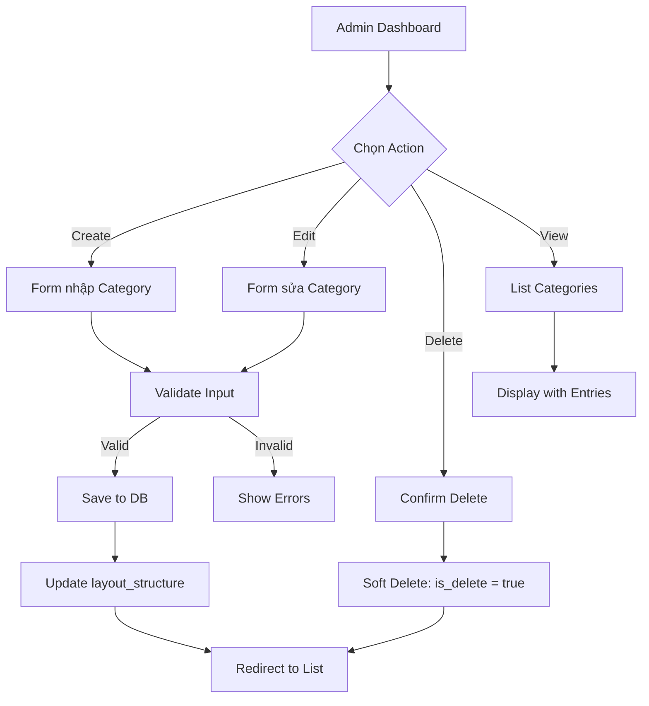
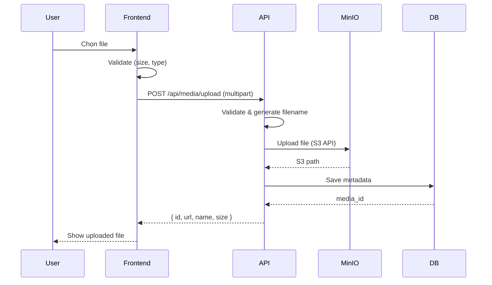
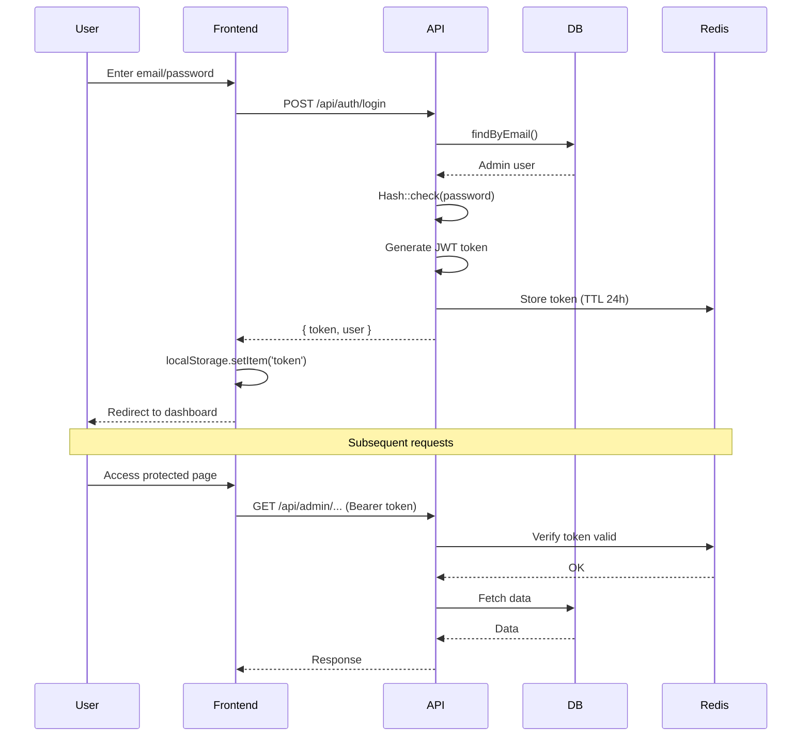

# 07. Tính Năng & Nghiệp Vụ - Features & Business Logic

> Mô tả chi tiết các tính năng chính, user flow và business logic

---

## 🎯 Tổng quan Tính năng

### Phân loại theo Module

| Module | Tính năng | Status |
|:-------|:----------|:-------|
| **Content Management** | CRUD Category, Entry, Entry Description | ✅ Done |
| **Media Management** | Upload, organize, delete files | ✅ Done |
| **Authentication** | Login, JWT, session management | ✅ Done |
| **Authorization** | Role-based access control (RBAC) | ✅ Done |
| **Search** | Full-text search, autocomplete | 🚧 In Progress |
| **Backup & Restore** | Auto backup, multi-cloud sync | ✅ Done |
| **Real-time** | WebSocket notifications | ✅ Done (basic) |
| **AI Features** | RAG, LLM integration | 📋 Planned |

---

## 1️⃣ Content Management System (CMS)

### 1.1 Category Management (Quản lý Danh mục)

#### User Flow



#### Business Logic

**Create Category**:

```php
// Backend: app/Services/CategoryService.php
public function createCategory(array $data): Category
{
    // 1. Validate
    $validated = $this->validate($data);
    
    // 2. Generate slug if not provided
    if (empty($validated['slug'])) {
        $validated['slug'] = Str::slug($validated['name']);
    }
    
    // 3. Ensure slug unique
    $validated['slug'] = $this->ensureUniqueSlug($validated['slug']);
    
    // 4. Create category
    $category = Category::create([
        'name' => $validated['name'],
        'slug' => $validated['slug'],
        'description' => $validated['description'] ?? null,
        'layout_structure' => null,  // Empty initially
        'status' => $validated['status'] ?? 0,
        'is_display' => $validated['is_display'] ?? false,
        'rank_order' => $validated['rank_order'] ?? 0,
    ]);
    
    // 5. Clear cache
    Cache::tags(['categories'])->flush();
    
    return $category;
}
```

**Update layout_structure**:

```php
public function updateLayoutStructure(int $categoryId, array $structure): void
{
    $category = Category::findOrFail($categoryId);
    
    // 1. Validate structure format
    $this->validateLayoutStructure($structure);
    
    // 2. Update
    $category->update([
        'layout_structure' => $structure,
        'updated_at' => now(),
    ]);
    
    // 3. Observer auto-create history record
    // (handled by CategoryObserver)
    
    // 4. Clear cache
    Cache::forget("category:{$categoryId}");
}

private function validateLayoutStructure(array $structure): void
{
    // Validate JSON schema
    foreach ($structure as $node) {
        if (!isset($node['ui_id'], $node['entry_mgmt_id'])) {
            throw new ValidationException('Invalid layout structure');
        }
        
        // Recursive validation for children
        if (isset($node['children']) && is_array($node['children'])) {
            $this->validateLayoutStructure($node['children']);
        }
    }
}
```

#### API Endpoints

```
GET    /api/admin/categories              # List all
GET    /api/admin/categories/{id}         # Get by ID
POST   /api/admin/categories              # Create
PUT    /api/admin/categories/{id}         # Update
DELETE /api/admin/categories/{id}         # Soft delete
PATCH  /api/admin/categories/{id}/layout  # Update layout_structure
```

#### Frontend Code Location

- **List page**: `nextjs-fe/src/app/[locale]/admin/categories/page.tsx`
- **Create form**: `nextjs-fe/src/components/features/categories/CategoryForm.tsx`
- **Layout editor**: `nextjs-fe/src/components/features/categories/LayoutEditor.tsx`

---

### 1.2 Entry Management (Quản lý Đầu mục)

#### Business Logic

**Đặc điểm**:
- Một Entry có thể xuất hiện ở nhiều Category (Many-to-Many via JSON)
- Entry có `layout_structure` riêng để quản lý Entry Descriptions

**Create Entry + Add to Category**:

```php
public function createEntryAndAttachToCategory(array $data, int $categoryId): Entry
{
    // 1. Create entry
    $entry = Entry::create([
        'name' => $data['name'],
        'slug' => Str::slug($data['name']),
        'layout_structure' => null,
        'status' => $data['status'] ?? 0,
        'is_display' => $data['is_display'] ?? false,
    ]);
    
    // 2. Add to category's layout_structure
    $category = Category::findOrFail($categoryId);
    $structure = $category->layout_structure ?? [];
    
    $structure[] = [
        'ui_id' => Str::uuid(),
        'entry_mgmt_id' => $entry->id,
        'name' => $entry->name,
        'slug' => $entry->slug,
        'children' => [],  // Empty initially
    ];
    
    $category->update(['layout_structure' => $structure]);
    
    return $entry;
}
```

---

### 1.3 Entry Description Management (Quản lý Nội dung)

#### Business Logic

**Rich Text Editor (Tiptap)**:

```typescript
// Frontend: nextjs-fe/src/components/features/editor/TiptapEditor.tsx
import { useEditor, EditorContent } from '@tiptap/react';
import StarterKit from '@tiptap/starter-kit';
import Image from '@tiptap/extension-image';
import Link from '@tiptap/extension-link';

const TiptapEditor = ({ content, onChange }) => {
  const editor = useEditor({
    extensions: [
      StarterKit,
      Image,
      Link,
      Highlight,
      TextStyle,
      Color,
    ],
    content: content,  // Tiptap JSON format
    onUpdate: ({ editor }) => {
      const json = editor.getJSON();
      onChange(json);  // Save to state
    },
  });

  return <EditorContent editor={editor} />;
};
```

**Save Article**:

```php
public function saveArticle(array $data): EntryDescription
{
    return EntryDescription::create([
        'title' => $data['title'],
        'summary' => $data['summary'],
        'article' => $data['article'],  // Tiptap JSON
        'status' => $data['status'] ?? 0,
        'is_display' => $data['is_display'] ?? false,
    ]);
}
```

**⚠️ Lưu ý**: `article` field lưu JSON, không lưu HTML.

---

## 2️⃣ Media Management

### 2.1 File Upload Flow



### 2.2 Business Logic

**Upload Handler**:

```php
// app/Services/MediaService.php
public function uploadFile(UploadedFile $file): MediaMgmt
{
    // 1. Validate
    $this->validateFile($file);
    
    // 2. Generate unique filename
    $extension = $file->getClientOriginalExtension();
    $filename = Str::uuid() . '.' . $extension;
    
    // 3. Determine folder by type
    $folder = $this->getFolderByMimeType($file->getMimeType());
    $date = now()->format('Y/m/d');
    $path = "{$folder}/{$date}/{$filename}";
    
    // 4. Upload to MinIO (S3)
    Storage::disk('s3')->put($path, file_get_contents($file));
    
    // 5. Save metadata to DB
    $media = MediaMgmt::create([
        'name' => $file->getClientOriginalName(),
        'path' => $path,
        'size' => $file->getSize(),
        'type' => $file->getMimeType(),
        'extension' => $extension,
        'status' => 1,  // Active
    ]);
    
    return $media;
}

private function getFolderByMimeType(string $mimeType): string
{
    if (str_starts_with($mimeType, 'image/')) return 'images';
    if (str_starts_with($mimeType, 'video/')) return 'videos';
    if (str_starts_with($mimeType, 'audio/')) return 'audios';
    return 'documents';
}
```

### 2.3 File Retrieval

**Generate Presigned URL** (temporary access):

```php
public function getPresignedUrl(int $mediaId, int $expiresInMinutes = 60): string
{
    $media = MediaMgmt::findOrFail($mediaId);
    
    return Storage::disk('s3')->temporaryUrl(
        $media->path,
        now()->addMinutes($expiresInMinutes)
    );
}
```

---

## 3️⃣ Authentication & Authorization

### 3.1 Login Flow (JWT)



### 3.2 Business Logic

**Login**:

```php
public function login(LoginRequest $request): array
{
    // 1. Find user
    $admin = Admin::where('email', $request->email)->first();
    
    if (!$admin || !Hash::check($request->password, $admin->password)) {
        // Increment failed attempts
        $this->incrementFailedAttempts($admin);
        throw new AuthenticationException('Invalid credentials');
    }
    
    // 2. Check if account locked
    if ($admin->limit_access >= 5) {
        throw new AccountLockedException('Account locked due to too many failed attempts');
    }
    
    // 3. Check if active
    if (!$admin->is_active) {
        throw new InactiveAccountException('Account inactive');
    }
    
    // 4. Generate JWT token
    $token = JWTAuth::fromUser($admin);
    
    // 5. Store token in Redis (với TTL)
    Redis::setex(
        "jwt:{$admin->id}:{$token}",
        config('jwt.ttl') * 60,  // 24 hours
        json_encode(['admin_id' => $admin->id, 'created_at' => now()])
    );
    
    // 6. Reset failed attempts
    $admin->update(['limit_access' => 0]);
    
    return [
        'token' => $token,
        'token_type' => 'Bearer',
        'expires_in' => config('jwt.ttl') * 60,
        'user' => $admin->only(['id', 'email', 'user_name', 'first_name', 'last_name']),
    ];
}
```

### 3.3 Authorization (RBAC)

**Middleware Check**:

```php
// app/Http/Middleware/CheckPermission.php
public function handle(Request $request, Closure $next, string $permission)
{
    $admin = auth()->user();
    
    // 1. Load admin's roles
    $roles = $admin->roles()->pluck('name')->toArray();
    
    // 2. Check if role has permission
    foreach ($roles as $role) {
        if ($this->roleHasPermission($role, $permission)) {
            return $next($request);
        }
    }
    
    throw new UnauthorizedException('You do not have permission to access this resource');
}

private function roleHasPermission(string $roleName, string $permission): bool
{
    // Check api_role_mst table
    return DB::table('api_role_mst')
        ->join('api_mst', 'api_role_mst.api_mst_id', '=', 'api_mst.id')
        ->join('role_mst', 'api_role_mst.role_mst_id', '=', 'role_mst.id')
        ->where('role_mst.name', $roleName)
        ->where('api_mst.endpoint', $permission)
        ->exists();
}
```

**Usage in routes**:

```php
Route::middleware(['auth:api', 'permission:admin.categories.create'])
    ->post('/admin/categories', [CategoryController::class, 'store']);
```

---

## 4️⃣ Search Feature (Planned)

### 4.1 Full-text Search Strategy

**PostgreSQL Full-text Search** (Current):

```php
public function searchEntries(string $query): Collection
{
    return EntryDescription::whereRaw(
        "to_tsvector('english', title || ' ' || summary) @@ plainto_tsquery('english', ?)",
        [$query]
    )
    ->orderByRaw("ts_rank(to_tsvector('english', title || ' ' || summary), plainto_tsquery('english', ?)) DESC", [$query])
    ->get();
}
```

**Elasticsearch Integration** (Planned):

```php
public function searchWithElasticsearch(string $query): Collection
{
    $results = Elasticsearch::search([
        'index' => 'entry_descriptions',
        'body' => [
            'query' => [
                'multi_match' => [
                    'query' => $query,
                    'fields' => ['title^3', 'summary^2', 'article'],  // title = 3x weight
                    'fuzziness' => 'AUTO',  // Typo tolerance
                ],
            ],
            'highlight' => [
                'fields' => [
                    'title' => new \stdClass(),
                    'summary' => new \stdClass(),
                ],
            ],
        ],
    ]);
    
    // Convert Elasticsearch results to Eloquent models
    return $this->hydrateModels($results['hits']['hits']);
}
```

### 4.2 Autocomplete/Typeahead

```typescript
// Frontend debounced search
import { useDebounce } from '@/lib/hooks/useDebounce';

const SearchBox = () => {
  const [query, setQuery] = useState('');
  const debouncedQuery = useDebounce(query, 300);  // Wait 300ms
  
  const { data: suggestions } = useQuery({
    queryKey: ['search-suggestions', debouncedQuery],
    queryFn: () => api.get('/api/search/suggestions', { params: { q: debouncedQuery } }),
    enabled: debouncedQuery.length >= 2,  // Only search if 2+ chars
  });
  
  return (
    <Combobox value={query} onChange={setQuery}>
      <ComboboxInput />
      <ComboboxOptions>
        {suggestions?.map((item) => (
          <ComboboxOption key={item.id} value={item}>
            {item.title}
          </ComboboxOption>
        ))}
      </ComboboxOptions>
    </Combobox>
  );
};
```

---

## 5️⃣ Backup & Restore

Chi tiết xem: [09. Bảo mật & Backup](./09-security-backup.md)

**Quick summary**:

- **Tự động backup** mỗi ngày lúc 2AM (cronjob)
- **Multi-cloud sync**: Google Drive, OneDrive, AWS S3
- **Atomic backup**: PostgreSQL dump + MinIO mirror + .env files
- **3-day retention**: Auto delete backups > 3 days old
- **Zero-local footprint**: Local backup folder auto-cleanup

---

## 6️⃣ Real-time Features (Laravel Reverb)

### 6.1 WebSocket Events

**Backend (Broadcast event)**:

```php
// app/Events/CategoryUpdated.php
class CategoryUpdated implements ShouldBroadcast
{
    use Dispatchable, InteractsWithSockets, SerializesModels;

    public function __construct(public Category $category) {}

    public function broadcastOn(): array
    {
        return [
            new Channel('categories'),
        ];
    }

    public function broadcastWith(): array
    {
        return [
            'id' => $this->category->id,
            'name' => $this->category->name,
            'updated_at' => $this->category->updated_at,
        ];
    }
}
```

**Trigger event**:

```php
// In CategoryService
public function updateCategory(int $id, array $data): Category
{
    $category = Category::findOrFail($id);
    $category->update($data);
    
    // Broadcast real-time update
    broadcast(new CategoryUpdated($category));
    
    return $category;
}
```

**Frontend (Listen)**:

```typescript
import Pusher from 'pusher-js';

const pusher = new Pusher(process.env.NEXT_PUBLIC_REVERB_APP_KEY!, {
  wsHost: process.env.NEXT_PUBLIC_REVERB_HOST,
  wsPort: parseInt(process.env.NEXT_PUBLIC_REVERB_PORT!),
  forceTLS: false,
  enabledTransports: ['ws'],
});

const channel = pusher.subscribe('categories');

channel.bind('CategoryUpdated', (data: any) => {
  console.log('Category updated:', data);
  // Refetch data or update local state
  queryClient.invalidateQueries(['categories']);
});
```

---

## 7️⃣ AI Features (Planned)

### 7.1 RAG (Retrieval-Augmented Generation)

**Architecture**:

```
User Query
    ↓
[Embedding Model] → Vector
    ↓
[Vector DB: ChromaDB/FAISS] → Top-K relevant docs
    ↓
[LLM: GPT-4] + Context (docs) → Generate Answer
    ↓
Response to User
```

**Implementation** (pseudo-code):

```python
def answer_question(user_query: str) -> str:
    # 1. Embed query
    query_vector = openai.embeddings.create(
        model="text-embedding-3-small",
        input=user_query
    )
    
    # 2. Search similar documents in ChromaDB
    results = chroma_collection.query(
        query_embeddings=[query_vector],
        n_results=5
    )
    
    # 3. Build context
    context = "\n\n".join([doc['text'] for doc in results['documents']])
    
    # 4. Generate answer with LLM
    response = openai.chat.completions.create(
        model="gpt-4",
        messages=[
            {"role": "system", "content": "You are a helpful assistant..."},
            {"role": "user", "content": f"Context:\n{context}\n\nQuestion: {user_query}"}
        ]
    )
    
    return response.choices[0].message.content
```

---

**Cập nhật lần cuối**: 2026-04-09
