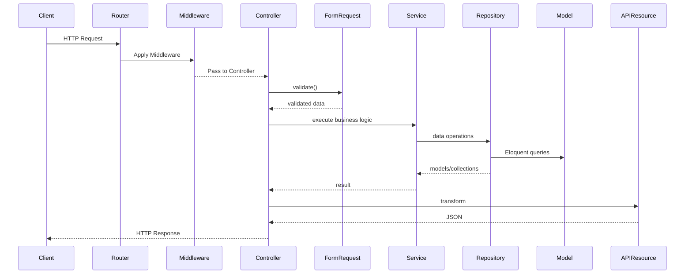

# Laravel API Coding Convention

**Mục đích:**

* Đảm bảo tính nhất quán, dễ đọc, dễ mở rộng và dễ bảo trì.
* Hỗ trợ cả developers và công cụ tự động (AI) hiểu và áp dụng chuẩn mực.
* Tạo nền tảng để triển khai nhanh, giảm thiểu lỗi phổ biến.

---

## Mục lục

1. [Tổng quan kiến trúc](#1-tổng-quan-kiến-trúc)
2. [Luồng xử lý API](#2-luồng-xử-lý-api)
3. [Cấu trúc thư mục](#3-cấu-trúc-thư-mục)
4. [Quy tắc chung & Naming](#4-quy-tắc-chung--naming)
5. [Thiết kế cơ sở dữ liệu](#5-thiết-kế-cơ-sở-dữ-liệu)
6. [Migration](#6-migration)
7. [Model](#7-model)
8. [Controller](#8-controller)
9. [Service](#9-service)
10. [FormRequest (Validation)](#10-formrequest-validation)
11. [Interface & Repository](#11-interface--repository)
12. [API Resource (Transformer)](#12-api-resource-transformer)
13. [Routing & Versioning](#13-routing--versioning)
14. [Error Handling & Logging](#14-error-handling--logging)
15. [Security & Authorization](#15-security--authorization)
16. [Testing](#16-testing)
17. [CI/CD & Documentation](#17-ci-cd--documentation)
18. [Quy trình triển khai](#18-quy-trình-triển-khai)

---

## 1. Tổng quan kiến trúc

* Kiến trúc **Layered** tuân thủ PSR‑12, kết hợp **Module-Based** theo scope (Master, Mgmt, History).
* Luồng rõ ràng: Presentation → Validation → Business → Data Access → Persistence.
* Hỗ trợ **Dependency Injection**, **SOLID**, **Repository Pattern**, **Service Layer**.

---

## 2. Luồng xử lý API

1. **Request**:

   * Client gửi HTTP request lên `routes/api.php`.
   * Middleware (auth, throttle) xử lý chung.
   * Controller nhận, gọi FormRequest để validation.
2. **Business**:

   * Controller inject Service, truyền dữ liệu đã validated.
   * Service xử lý logic, gọi Repository.
3. **Data Access**:

   * Repository tương tác Eloquent Model, Query Builder.
   * Tất cả truy vấn, transaction ở đây.
4. **Response**:

   * Service trả data về Controller.
   * Controller trả về API Resource để format JSON chuẩn.



---

## 3. Cấu trúc thư mục

```text
app/
├─ Http/
│  ├─ Controllers/{Master,Mgmt,History}/
│  ├─ Requests/{Master,Mgmt,History}/
│  └─ Resources/{Master,Mgmt,History}/
├─ Services/{Master,Mgmt,History}/
├─ Interfaces/{Master,Mgmt,History}/
├─ Repositories/{Master,Mgmt,History}/
├─ Models/{Master,Mgmt,History}/
├─ Exceptions/
└─ Providers/
```

* Mỗi module (`Master`, `Mgmt`, `History`) lặp cấu trúc tương tự.
* Bổ sung `Exceptions` cho custom exception classes.

---

## 4. Quy tắc chung & Naming

| Đối tượng         | Convention                   | Ví dụ                        |
| ----------------- | ---------------------------- | ---------------------------- |
| Class             | PascalCase                   | `UserService`                |
| Method / Variable | camelCase                    | `getAllUsers()`              |
| Constant          | UPPER\_SNAKE                 | `STATUS_ACTIVE`              |
| DB table / column | snake\_case (singular table) | `user_profile`, `first_name` |
| Route URL         | kebab-case                   | `/api/user-profiles`         |
| Config key        | dot.notation                 | `app.locale`                 |

* Ngôn ngữ: **Tiếng Anh**, số ít, không dấu.
* Tất cả header comment, docblock theo `[PSR-5 phpdoc]`.
* Tối đa 120 ký tự mỗi dòng.

---

## 5. Thiết kế cơ sở dữ liệu

* **Table name:** snake\_case, suffix `_mst`, `_mgmt`, `_hist` theo loại data.
* **Primary key:** `id` (bigIncrements) hoặc ULID nếu cần.
* **Foreign key:** `{related_table_singular}_id` + index.
* **Columns:** loại dữ liệu rõ ràng, length, default, nullable.
* **Timestamps:** `created_at`, `updated_at`, optional `deleted_at` (soft deletes).
* **Index:** unique, composite, fulltext (nếu cần).

Ví dụ định nghĩa migration:

```php
Schema::create('user_mgmt', function (Blueprint $table) {
    $table->ulid('id')->primary();
    $table->string('first_name', 50);
    $table->string('email')->unique();
    $table->boolean('is_active')->default(true);
    $table->ulid('role_id')->index();
    $table->timestamps();
    $table->softDeletes();
});
```

---

## 6. Migration

1. **Tạo file:**

   ```bash
   php artisan make:migration create_{table}_table --path=database/migrations/{scope}
   ```
2. **Tên file:** `YYYY_MM_DD_HHMMSS_create_table_scope.php`.
3. **Schema Up:**

   * `Schema::create` hoặc `Schema::table`.
   * `Blueprint` định nghĩa cột, index, foreign key.
4. **Schema Down:** rollback đầy đủ, drop constraints trước drop table.
5. **Custom statements:** `DB::statement` cho view, trigger, procedure.
6. **Seeder (nếu cần):** `php artisan make:seeder {Scope}Seeder`.
7. **Best practices:** luôn chạy `php artisan migrate:rollback` để kiểm thử rollback.

---

## 7. Model

* `php artisan make:model {Scope}/{Model}`.
* **Thuộc tính:**

  * `$table`, `$primaryKey`, `$keyType` rõ ràng khi khác default.
  * `$fillable` hoặc `$guarded` để bảo vệ mass-assignment.
  * `$casts` để ép kiểu `boolean`, `datetime`, `array`.
* **Traits:** `SoftDeletes`, `HasUlids`, `HasFactory`.
* **Mutators / Accessors:** sử dụng `getXxxAttribute` và `setXxxAttribute`.
* **Query Scopes:** global/local scope để tái sử dụng điều kiện.
* **Quan hệ:** phương thức camelCase trả về Eloquent relation.

```php
class User extends Model {
    use SoftDeletes, HasFactory;

    protected $table = 'user_mgmt';
    protected $fillable = ['first_name', 'email', 'role_id', 'is_active'];
    protected $casts = ['is_active' => 'boolean'];

    public function role(): BelongsTo {
        return \$this->belongsTo(Role::class);
    }

    public function scopeActive(Builder \$query): Builder {
        return \$query->where('is_active', true);
    }
}
```

---

## 8. Controller

* `php artisan make:controller {Scope}/{Resource}Controller`.
* **Dependency Injection:** nhận Service, FormRequest, APIResource.
* **Pattern:**

  ```php
  public function store(StoreUserRequest \$request): JsonResponse { 
      \$data = \$request->validated();
      \$result = \$this->userService->create(\$data);
      return new UserResource(\$result);
  }
  ```
* **Error handling:** tránh try/catch trong controller; throw custom exceptions, xử lý ở middleware ExceptionHandler.
* **HTTP Response codes:** 200 OK, 201 Created, 204 No Content, 400 Bad Request, 404 Not Found, 422 Unprocessable Entity.

---

## 9. Service

* Thư mục: `app/Services/{Scope}`.
* Kế thừa `BaseService` nếu có.
* Chỉ chứa business logic, transaction, gọi Repository.
* Phân tách rõ:

  * `create`, `update`, `delete`, `getById`, `list`.
* Không trả `JsonResponse` trực tiếp, chỉ trả data/Model.

```php
class UserService {
    public function __construct(private UserRepositoryInterface \$repo) {}

    public function create(array \$data): User {
        return DB::transaction(fn() => \$this->repo->create(\$data));
    }
}
```

---

## 10. FormRequest (Validation)

* `php artisan make:request {Scope}/{StoreUserRequest}`.
* **Phương thức:**

  * `authorize()` trả `true` hoặc logic phân quyền.
  * `rules()` liệt kê rules dựa trên migration.
  * `messages()` custom thông báo lỗi.
  * `prepareForValidation()` để chỉnh sửa input trước validate.

```php
public function rules(): array {
    return [
        'email' => 'required|email|unique:user_mgmt',
        'first_name' => 'required|string|max:50',
    ];
}
```

---

## 11. Interface & Repository

* **Interface**: `app/Interfaces/{Scope}/{UserRepositoryInterface}`.
* **Repository** implement interface tại `app/Repositories/{Scope}/UserRepository`.
* **ServiceProvider** bind:

  ```php
  \$this->app->bind(
      UserRepositoryInterface::class,
      UserRepository::class
  );
  ```
* **Repository methods:** tương ứng với Service.

---

## 12. API Resource (Transformer)

* `php artisan make:resource {Scope}/UserResource` & `UserCollection`.
* **Phương thức** `toArray()`:

  * expose chỉ fields cần thiết.
  * `whenLoaded()` cho relations.
  * `additional()` cho meta data (pagination).

```php
public function toArray(\$request): array {
    return [
        'id' => \$this->id,
        'name' => \$this->first_name,
        'role' => new RoleResource(\$this->whenLoaded('role')),
    ];
}
```

---

## 13. Routing & Versioning

* Định nghĩa trong `routes/api.php` hoặc `routes/v1.php`, `v2.php`.
* Nhóm:

  ```php
  Route::prefix('v1')
       ->middleware(['auth:sanctum'])
       ->group(function() {
           Route::apiResource('users', UserController::class);
       });
  ```
* Sử dụng `apiResource`, `apiResources` cho CRUD chuẩn.
* Tên route (`->names()` hoặc `->name()`).

---

## 14. Error Handling & Logging

* **ExceptionHandler:** map custom exceptions đến HTTP codes.
* **Custom Exceptions:** `NotFoundException`, `ValidationException`, `BusinessException`.
* **Logging:** dùng Log facade, phân level (`info`, `warning`, `error`).
* **Response chuẩn lỗi:**

  ```json
  {
    "error": {
      "code": "USER_NOT_FOUND",
      "message": "User not found."
    }
  }
  ```

---

## 15. Security & Authorization

* **Authentication:** Sanctum / Passport.
* **Authorization:** Policies (`php artisan make:policy`), Gates.
* **Scopes/Roles:** kiểm tra trong Service hoặc FormRequest.
* **Rate Limiting:** `throttle:60,1` middleware.
* **Input Sanitization:** strip\_tags, cast types.

---

## 16. Testing

* **Unit tests:** Service, Repository.
* **Feature tests:** HTTP endpoints, validation, auth.
* **Factories & Seeders:** dựng data nhanh.
* **Test structure:**

  ```text
  tests/
  ├─ Unit/{Scope}/
  └─ Feature/{Scope}/
  ```
* **Thực thi:** `php artisan test` hoặc `./vendor/bin/phpunit`.

---

## 17. CI/CD & Documentation

* **CI pipeline:** lint (PHPStan), style (PHPCS), test, migrate.
* **CD:** deploy migrations tự động.
* **API Docs:** OpenAPI/Swagger YAML hoặc annotation + `swagger-php`.
* **Changelog & Versioning:** theo SemVer.

---

## 18. Quy trình triển khai

1. Xác định scope tính năng.
2. Tạo Migration + Seeder.
3. Model + Relations + Factory.
4. Interface + Repository.
5. Service (business logic).
6. FormRequest (validation + authorize).
7. Controller + API Resource.
8. Routing + Middleware.
9. Testing (unit + feature).
10. Update API Docs, Changelog.
11. CI/CD chạy validate & deploy.

> **Lưu ý:** Luôn tuân thủ code review, viết comment rõ ràng, và cập nhật tài liệu thay đổi.
