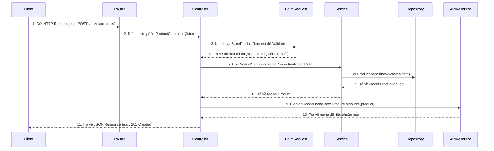

Chào bạn,

Rất hoan nghênh tinh thần xây dựng một bộ quy ước mã hóa (coding convention) chi tiết cho dự án của bạn. File bạn đính kèm là một nền tảng rất vững chắc, thể hiện sự đầu tư và tư duy có hệ thống. Việc chuẩn hóa này là yếu tố then chốt để đảm bảo dự án phát triển bền vững, dễ bảo trì, và đặc biệt là giúp các thành viên mới hội nhập nhanh chóng.

Tôi đã phân tích tài liệu của bạn, kết hợp với các thực tiễn tốt nhất (best practices) trong phát triển API bằng Laravel để đưa ra một phiên bản cập nhật, bổ sung và tối ưu hơn. Mục tiêu là xây dựng một cấu trúc mạch lạc, phân chia rõ ràng trách nhiệm của từng thành phần và mô tả một luồng xử lý API hoàn chỉnh.

Dưới đây là phiên bản quy ước chi tiết đã được cải tiến.

---

# **Quy ước mã hóa và Kiến trúc cho dự án Laravel API**

Tài liệu này định nghĩa các quy ước và kiến trúc chuẩn cho việc phát triển API, dựa trên nền tảng Laravel và các tiêu chuẩn PSR-2/PSR-12.

## **1. Triết lý và Luồng hoạt động của một API Request**

Để đảm bảo tính nhất quán và dễ mở rộng, mọi luồng xử lý cho một request API sẽ tuân thủ theo kiến trúc phân lớp rõ ràng. Mỗi lớp có một nhiệm vụ duy nhất (Single Responsibility Principle).

**Luồng xử lý (Request Flow):**

`Route` -> `Middleware` -> `Controller` -> `Form Request (Validation)` -> `Service` -> `Repository` -> `Model` -> `Database`

**Luồng trả về (Response Flow):**

`Database` -> `Model` -> `Repository` -> `Service` -> `Controller` -> `API Resource (Transformation)` -> `JSON Response`

**Sơ đồ luồng hoạt động:**



**Ý nghĩa của các thành phần:**
* **Route:** Định nghĩa điểm cuối (endpoint) của API.
* **Controller:** Lớp tiếp nhận HTTP request. **Nhiệm vụ duy nhất:** điều phối request, gọi Service tương ứng, và trả về response (đã qua API Resource). Controller **không** chứa logic nghiệp vụ.
* **Form Request:** Lớp chịu trách nhiệm xác thực (validation) dữ liệu đầu vào. Giúp Controller luôn "sạch".
* **Service:** Chứa toàn bộ logic nghiệp vụ (business logic) của ứng dụng. Đây là "bộ não" của tính năng. Service có thể gọi các Service khác hoặc Repository.
* **Interface & Repository:** Lớp trừu tượng hóa việc truy xuất dữ liệu. Giúp Service không phụ thuộc trực tiếp vào Eloquent hay nguồn dữ liệu cụ thể.
    * **Interface:** Định nghĩa các "hợp đồng" (methods) mà Repository phải tuân theo.
    * **Repository:** Triển khai (implement) Interface, chứa các truy vấn đến cơ sở dữ liệu.
* **Model:** Đại diện cho một bảng trong cơ sở dữ liệu, xử lý các mối quan hệ và định nghĩa thuộc tính.
* **API Resource:** Lớp chịu trách nhiệm biến đổi (transform) dữ liệu từ Model thành định dạng JSON trả về cho client. Giúp tách biệt cấu trúc DB và cấu trúc API response.

## **2. Cấu trúc thư mục chuẩn**

Cấu trúc thư mục được tổ chức theo nghiệp vụ và loại đối tượng, với việc áp dụng nhất quán phân loại `Master`, `Management`, và `History`.

```
app/
├── Http/
│   ├── Controllers/
│   │   └── V1/
│   │       ├── Master/
│   │       │   └── CategoryController.php
│   │       └── Management/
│   │           └── ProductController.php
│   ├── Middleware/
│   ├── Requests/
│   │   ├── Master/
│   │   │   └── Category/
│   │   │       ├── StoreCategoryRequest.php
│   │   │       └── UpdateCategoryRequest.php
│   │   └── Management/
│   │       └── Product/
│   │           └── StoreProductRequest.php
│   └── Resources/
│       ├── Master/
│       │   └── CategoryResource.php
│       └── Management/
│           └── ProductResource.php
├── Interfaces/
│   ├── Master/
│   │   └── CategoryRepositoryInterface.php
│   └── Management/
│       └── ProductRepositoryInterface.php
├── Models/
│   ├── Master/
│   │   └── Category.php
│   ├── Management/
│   │   └── Product.php
│   └── History/
│       ├── Master/
│       │   └── CategoryHist.php
│       └── Management/
│           └── ProductMgmtHist.php
├── Providers/
│   └── RepositoryServiceProvider.php
├── Repositories/
│   ├── Master/
│   │   └── EloquentCategoryRepository.php
│   └── Management/
│       └── EloquentProductRepository.php
└── Services/
    ├── Master/
    │   └── CategoryService.php
    └── Management/
        └── ProductService.php

database/
└── migrations/
    ├── Table/
    │   ├── Master/
    │   │   └── 2025_06_20_000000_create_category_mst.php
    │   └── Management/
    │       └── 2025_06_20_000001_create_product_mgmt.php
    └── View/
    └── Procedure/
    └── ... (các loại khác)
```

## **3. Quy ước chung**
* **Chuẩn code:** Luôn tuân thủ **PSR-12**.
* **Ngôn ngữ:** Sử dụng tiếng Anh cho toàn bộ tên file, class, method, variable, và comment.
* **Naming Conventions:**
    * **Class (Model, Controller, Service...):** `PascalCase`, số ít. (Vd: `ProductService`)
    * **Method, Variable:** `camelCase`. (Vd: `getAllProducts`)
    * **Hằng số (Constants):** `CONSTANT_CASE`. (Vd: `const STATUS_ACTIVE = 1;`)
    * **Bảng và Cột trong DB:** `snake_case`. (Vd: `product_mgmt`, `rank_order`)
    * **Tên file Route:** `snake_case`. (Vd: `product_routes.php`)

## **4. Thiết kế Cơ sở dữ liệu**

(Các quy tắc bạn đặt ra đã rất tốt, tôi chỉ tinh chỉnh và bổ sung một điểm quan trọng)

* **Table:**
    * **Định danh:** `snake_case`, số ít. (Vd: `user`, `product`)
    * **Hậu tố `_mst`:** Bảng dữ liệu gốc, cốt lõi (master data). (Vd: `category_mst`)
    * **Hậu tố `_mgmt`:** Bảng dữ liệu quản lý, nghiệp vụ (management data). (Vd: `product_mgmt`, `order_mgmt`)
    * **Hậu tố `_hist`:** Bảng lưu lịch sử. (Vd: `product_mgmt_hist`)
    * **Bảng trung gian (N-N):** Tên gồm 2 bảng liên quan, theo thứ tự alphabet. (Vd: `product_tag_mgmt`)

* **Column:**
    * **Định danh:** `snake_case`, tên đầy đủ, không viết tắt.
    * **Khóa chính (Primary Key):** Luôn là `id`, kiểu `bigIncrements` hoặc `ulid` (khuyến khích).
    * **Khóa ngoại (Foreign Key):** Tên bảng (số ít) + `_id`. (Vd: `category_id` trong bảng `product_mgmt`).
    * **Boolean:** Tiền tố `is_` hoặc `has_`. (Vd: `is_active`, `has_stock`).
    * **Timestamps:** Luôn có `created_at` và `updated_at` kiểu `timestamp`.

* **Khóa ngoại (Foreign Keys):**
    * **KHUYẾN NGHỊ CỰC KỲ QUAN TRỌNG:** **Luôn luôn phải định nghĩa khóa ngoại** trong migration. Việc nói "không định nghĩa để giảm sự phức tạp" là một thực hành rất rủi ro, dẫn đến mất toàn vẹn dữ liệu (data integrity).
    * Lợi ích của khóa ngoại:
        * **Đảm bảo toàn vẹn dữ liệu:** Ngăn chặn việc tạo bản ghi con trỏ đến bản ghi cha không tồn tại.
        * **Tự động hóa (Cascading):** Dễ dàng thiết lập các hành động `onDelete('cascade')` hoặc `onUpdate('cascade')`.
        * **Tài liệu hóa cấu trúc:** Khóa ngoại là một phần tài liệu sống, giúp developer hiểu rõ mối quan hệ giữa các bảng.

* **Chú thích (Comments):** Mọi bảng và cột phải có comment rõ ràng trong migration.
    ```php
    $table->string('name', 100)->comment('Tên sản phẩm');
    $table->foreignId('category_id')->comment('ID của danh mục')->constrained('category_mst');
    ```

## **5. Migrations**

* **Lệnh tạo:**
    ```bash
    php artisan make:migration create_product_mgmt_table --path=database/migrations/Table/Management
    ```
* **Tên file:** `YYYY_MM_DD_HHMMSS_action_table_name_suffix.php`. (Vd: `2025_06_20_101500_create_product_mgmt_table.php`)
* **Nội dung:**
    * Sử dụng `Schema::create` và `Schema::table`.
    * Luôn viết logic hoàn tác trong method `down()`.
    * Đối với View, Procedure, Trigger, dùng `DB::statement()` trong `up()` và `DROP...` trong `down()`.

## **6. Interface & Repository**

* **Interface:**
    * **Vị trí:** `app/Interfaces/[Scope]` (Vd: `app/Interfaces/Management/ProductRepositoryInterface.php`)
    * **Tên:** `[ModelName]RepositoryInterface`. (Vd: `ProductRepositoryInterface`)
    * **Nội dung:** Định nghĩa các method cần có.
        ```php
        interface ProductRepositoryInterface {
            public function getAll(array $filters);
            public function findById(int $id);
            public function create(array $data): Product;
            public function update(int $id, array $data): bool;
        }
        ```

* **Repository:**
    * **Vị trí:** `app/Repositories/[Scope]` (Vd: `app/Repositories/Management/EloquentProductRepository.php`)
    * **Tên:** `Eloquent[ModelName]Repository`.
    * **Nội dung:** Triển khai Interface và chứa logic truy vấn DB.
        ```php
        class EloquentProductRepository implements ProductRepositoryInterface {
            // ... implement methods
        }
        ```

* **Binding:** Đăng ký Interface với Repository trong `app/Providers/RepositoryServiceProvider.php`.
    ```php
    // Trong method register()
    $this->app->bind(
        \App\Interfaces\Management\ProductRepositoryInterface::class,
        \App\Repositories\Management\EloquentProductRepository::class
    );
    ```

## **7. Model**

* **Vị trí:** `app/Models/[Scope]`. (Vd: `app/Models/Management/Product.php`)
* **Tên:** `PascalCase`, số ít. (Vd: `Product`)
* **Quy ước:**
    * `protected $table = 'product_mgmt';`
    * `protected $fillable = ['name', 'price', 'category_id', ...];`
    * `protected $hidden = ['password'];` (Che các thuộc tính nhạy cảm)
    * `protected $casts = ['is_active' => 'boolean', 'price' => 'float'];` (Tự động chuyển kiểu)
    * Tên hàm quan hệ: `camelCase`, số ít cho `belongsTo/hasOne`, số nhiều cho `hasMany/belongsToMany`. (Vd: `public function category()`, `public function tags()`)

## **8. Service**

* **Vị trí:** `app/Services/[Scope]`. (Vd: `app/Services/Management/ProductService.php`)
* **Tên:** `[ModelName]Service`.
* **Quy ước:**
    * **Không kế thừa Singleton:** Thay vào đó, hãy để Service Container của Laravel quản lý.
    * **Dependency Injection:** Inject các Repository hoặc Service khác qua constructor.
        ```php
        protected $productRepository;

        public function __construct(\App\Interfaces\Management\ProductRepositoryInterface $productRepository) {
            $this->productRepository = $productRepository;
        }
        ```
    * **Nhiệm vụ:** Chứa logic nghiệp vụ. Method trong Service sẽ nhận dữ liệu đã được validate, xử lý và trả về kết quả (Model, Collection, DTO, boolean...).

## **9. Validate Request (Form Request)**

* **Lệnh tạo:**
    ```bash
    php artisan make:request Management/Product/StoreProductRequest
    ```
* **Vị trí:** `app/Http/Requests/[Scope]/[ModelName]`. (Vd: `app/Http/Requests/Management/Product/StoreProductRequest.php`)
* **Nội dung:**
    * `authorize()`: Trả về `true` (logic phân quyền nên đặt ở Middleware hoặc Controller/Service nếu phức tạp).
    * `rules()`: Định nghĩa các luật validation, tận dụng các Rule object của Laravel.
    * `messages()`: Tùy chỉnh các thông báo lỗi.

## **10. Controller**

* **Lệnh tạo:**
    ```bash
    php artisan make:controller V1/Management/ProductController --api
    ```
* **Vị trí:** `app/Http/Controllers/[Version]/[Scope]`. (Vd: `app/Http/Controllers/V1/Management/ProductController.php`)
* **Quy ước:**
    * **Controller "mỏng":** Chỉ làm nhiệm vụ điều phối.
    * **Dependency Injection:** Inject Service và Form Request.
    * **Error Handling:** Sử dụng `try-catch` để bắt các Exception cụ thể và trả về response lỗi chuẩn.
        ```php
        public function store(StoreProductRequest $request): \Illuminate\Http\JsonResponse
        {
            try {
                $product = $this->productService->createProduct($request->validated());
                return (new ProductResource($product))
                        ->response()
                        ->setStatusCode(201);
            } catch (\Exception $e) {
                // Log the exception
                return response()->json(['message' => 'An unexpected error occurred.'], 500);
            }
        }
        ```

## **11. API Resources**

* **Lệnh tạo:**
    ```bash
    php artisan make:resource Management/ProductResource
    ```
* **Vị trí:** `app/Http/Resources/[Scope]`. (Vd: `app/Http/Resources/Management/ProductResource.php`)
* **Mục đích:** Định dạng dữ liệu trả về, đảm bảo API response nhất quán và không bị lộ cấu trúc DB.
    ```php
    public function toArray($request): array
    {
        return [
            'id' => $this->id,
            'productName' => $this->name, // Thay đổi key trả về
            'price' => $this->price,
            'isActive' => $this->is_active,
            'category' => new CategoryResource($this->whenLoaded('category')), // Tải quan hệ
            'createdAt' => $this->created_at->toIso8601String(),
        ];
    }
    ```

## **12. Routing**

* **Vị trí:** `routes/api.php`.
* **Versioning:** Luôn đặt các route trong một group có tiền tố phiên bản.
* **Grouping:** Nhóm các route theo resource để dễ quản lý.
* **Naming:** Đặt tên cho các route.
    ```php
    use App\Http\Controllers\V1\Management\ProductController;

    Route::prefix('v1')->name('api.v1.')->group(function () {
        Route::apiResource('products', ProductController::class)
            ->middleware('auth:sanctum');
    });
    ```

---

Bằng cách áp dụng cấu trúc và quy ước này, dự án của bạn sẽ có một nền móng cực kỳ vững chắc, dễ dàng cho việc bảo trì, mở rộng và chào đón các thành viên mới. Chúc bạn và đội nhóm thành công!