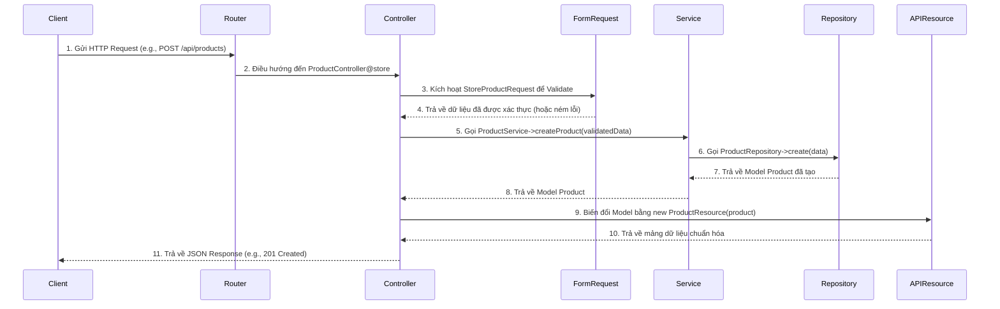

# **Tựa đề quy ước mã hóa**
Hướng dẫn quy ước mã hóa (Coding Convention) trong dự án Laravel API
Tài liệu này định nghĩa các quy tắc và cấu trúc cho dự án Laravel API, nhằm đảm bảo tính nhất quán, dễ mở rộng, bảo trì, và dễ tiếp cận cho các thành viên mới.

## **Tổng quan cấu trúc dự án API**

Thiết kế dự án theo kiến trúc **Layered Architecture** (Service Layer, Repository Layer, Domain Layer) kết hợp **Module-based Organization** để dễ mở rộng và bảo trì. Mỗi module (theo tính năng hoặc phạm vi như Master / Management / History) được tổ chức thành các phần: Migration, Model, Repository, Service, Request Validation, Controller, Resource, Route.

# **Quy ước mã hóa và Kiến trúc cho dự án Laravel API**

Tài liệu này định nghĩa các quy ước và kiến trúc chuẩn cho việc phát triển API, dựa trên nền tảng Laravel và các tiêu chuẩn PSR-2/PSR-12.

## **Triết lý và Luồng hoạt động của một API Request**

Để đảm bảo tính nhất quán và dễ mở rộng, mọi luồng xử lý cho một request API sẽ tuân thủ theo kiến trúc phân lớp rõ ràng. Mỗi lớp có một nhiệm vụ duy nhất (Single Responsibility Principle).

**Luồng xử lý (Request Flow):**

`Route` -> `Middleware` -> `Controller` -> `Form Request (Validation)` -> `Service` -> `Repository` -> `Model` -> `Database`

**Luồng trả về (Response Flow):**

`Database` -> `Model` -> `Repository` -> `Service` -> `Controller` -> `API Resource (Transformation)` -> `JSON Response`

**Sơ đồ luồng hoạt động:**



**Ý nghĩa của các thành phần:**
* **Route:** Định nghĩa điểm cuối (endpoint) của API.
* **Controller:** Lớp tiếp nhận HTTP request. **Nhiệm vụ duy nhất:** điều phối request, gọi Service tương ứng, và trả về response (đã qua API Resource). Controller **không** chứa logic nghiệp vụ.
* **Form Request:** Lớp chịu trách nhiệm xác thực (validation) dữ liệu đầu vào. Giúp Controller luôn "sạch".
* **Service:** Chứa toàn bộ logic nghiệp vụ (business logic) của ứng dụng. Đây là "bộ não" của tính năng. Service có thể gọi các Service khác hoặc Repository.
* **Interface & Repository:** Lớp trừu tượng hóa việc truy xuất dữ liệu. Giúp Service không phụ thuộc trực tiếp vào Eloquent hay nguồn dữ liệu cụ thể.
    * **Interface:** Định nghĩa các "hợp đồng" (methods) mà Repository phải tuân theo.
    * **Repository:** Triển khai (implement) Interface, chứa các truy vấn đến cơ sở dữ liệu.
* **Model:** Đại diện cho một bảng trong cơ sở dữ liệu, xử lý các mối quan hệ và định nghĩa thuộc tính.
* **API Resource:** Lớp chịu trách nhiệm biến đổi (transform) dữ liệu từ Model thành định dạng JSON trả về cho client. Giúp tách biệt cấu trúc DB và cấu trúc API response.

## **Cấu trúc thư mục chuẩn**

Cấu trúc thư mục được tổ chức theo nghiệp vụ và loại đối tượng, với việc áp dụng nhất quán phân loại `Master`, `Management`, và `History`.

```
app/
├── Http/
│   ├── Controllers/
│   │   ├── History/
│   │   │   ├── Master/
│   │   │   │   └── CategoryMstHistController.php
│   │   │   └── Management/
│   │   │       └── CategoryMgmtHistController.php
│   │   ├── Master/
│   │   │   └── CategoryMstController.php
│   │   └── Management/
│   │       └── ProductMgmtController.php
│   ├── Middleware/
│   ├── Requests/
│   │   ├── History/
│   │   │   ├── Master/
│   │   │   │   ├── CategoryMstHistListRequest.php
│   │   │   │   └── StoreCategoryMstHistRequest.php
│   │   │   └── Management/
│   │   │       ├── UpdateCategoryMgmtHistRequest.php
│   │   │       └── DeleteCategoryMgmtHistRequest.php
│   │   ├── Master/
│   │   │   └── CategoryMstRequest.php
│   │   └── Management/
│   │       └── ProductMgmtRequest.php
│   └── Resources/
│       ├── History/
│       │   ├── Master/
│       │   │   └── CategoryMstHistResource.php
│       │   └── Management/
│       │       └── CategoryMgmtHistResource.php
│       ├── Master/
│       │   └── CategoryMstResource.php
│       └── Management/
│           └── ProductMgmtResource.php
├── Interfaces/
│   ├── History/
│   │   ├── Master/
│   │   │   └── CategoryMstHistInterface.php
│   │   └── Management/
│   │       └── CategoryMgmtHistInterface.php
│   ├── Master/
│   │   └── CategoryMstInterface.php
│   └── Management/
│       └── ProductMgmtInterface.php
├── Repository/
│   ├── History/
│   │   ├── Master/
│   │   │   └── CategoryMstHistRepository.php
│   │   └── Management/
│   │       └── CategoryMgmtHistRepository.php
│   ├── Master/
│   │   └── CategoryMstRepository.php
│   └── Management/
│       └── ProductMgmtRepository.php
├── Models/
│   ├── Master/
│   │   └── CategoryMst.php
│   ├── Management/
│   │   └── ProductMgmt.php
│   └── History/
│       ├── Master/
│       │   └── CategoryMstHist.php
│       └── Management/
│           └── ProductMgmtHist.php
├── Providers/
│   └── RepositoryServiceProvider.php
└── Services/
    ├── Master/
    │   └── CategoryMstService.php
    ├── Management/
    │   └── ProductMgmtService.php
    └── History/
        ├── Master/
        │   └── CategoryMstHistService.php
        └── Management/
            └── ProductMgmtHistService.php

database/
└── migrations/
    ├── Table/
    │   ├── History/
    │   │   ├── Master/
    │   │   │   └── 2025_06_20_000000_create_category_mst_hist_table.php
    │   │   └── Management/
    │   │       └── 2025_06_20_000000_create_category_mgmt_hist_table.php
    │   ├── Master/
    │   │   └── 2025_06_20_000000_create_category_mst_table.php
    │   └── Management/
    │       └── 2025_06_20_000001_create_product_mgmt_table.php
    └── View/
    └── Procedure/
    └── ... (các loại khác)
```

## **Quy ước chung**
* **Chuẩn code:** Luôn tuân thủ **PSR-12**.
* **Ngôn ngữ:** Sử dụng tiếng Anh số ít cho toàn bộ tên file, class, method, variable, và comment.
* **Naming Conventions:**
    * **Class (Model, Controller, Service...):** `PascalCase`, số ít. (Vd: `ProductService`)
    * **Method, Variable:** `camelCase`. (Vd: `getAllProducts`)
    * **Hằng số (Constants):** `CONSTANT_CASE`. (Vd: `const STATUS_ACTIVE = 1;`)
    * **Bảng và Cột trong DB:** `snake_case`. (Vd: `product_mgmt`, `rank_order`)
    * **Tên file Route:** `kebab-case`, tham số `snake_case`. và thống nhất kiểu cho url. Ví dụ các loại method trong RESTful
    ** **GET:** `/api/user-permissions?created_from=2024-01-01&is_active=true`
    ** **POST:** `/api/user-permissions`
    ** **UPDATE:** `/api/user-permissions/{123}`
    ** **DELETE:** `/api/user-permissions/{123}`

## **Thiết kế Cơ sở dữ liệu**
* **Table:**
    * **Định danh:** `snake_case`, số ít. (Vd: `user`, `product`)
    * **Hậu tố `_mst`:** Bảng dữ liệu gốc, cốt lõi (master data). (Vd: `category_mst`)
    * **Hậu tố `_mgmt`:** Bảng dữ liệu quản lý, nghiệp vụ (management data). (Vd: `product_mgmt`, `order_mgmt`)
    * **Hậu tố `_hist`:** Bảng lưu lịch sử. (Vd: `product_mgmt_hist`)
    * **Bảng trung gian (N-N):** Tên gồm 2 bảng liên quan, theo thứ tự alphabet. (Vd: `product_tag_mgmt`)

* **Column:**
    ** **Định danh:** Theo dạng **snake_case** số ít và ko viết tắt, ko dấu, tiếng anh.
    * **Khóa chính (Primary Key):** Luôn là `id`, kiểu `bigIncrements` hoặc `ulid` (khuyến khích). Kiểu auto-increment.
    * **Khóa ngoại (Foreign Key):** Tên bảng (số ít) + `_id`. (Vd: `category_id` trong bảng `product_mgmt`). Nếu có phải định nghĩa rõ trong table để toàn vẹn dữ liệu, tự động hóa (cascading), tài liệu hóa cấu trúc.
    * **Boolean:** Tiền tố `is_` hoặc `has_`. (Vd: `is_active`, `has_stock`).
    * **Timestamps:** Luôn có `created_at` và `updated_at` kiểu `timestamp`.

* **Loại dữ liệu:** các column cần phân tích kiểu và kích thước tối thiểu hoặc tối đa mà dữ liệu cần sử dụng hiện tại và mở rộng trong tương lai để đưa ra để đảm bảo khả năng lưu trữ. Có thể dựa theo các quy chuẩn quốc tế về các loại dữ liệu và mục đích sử dụng để triển khai. Ví dụ kích thước cho số điện thoại là 12 kí tự, email là 320 kí tự,...

* **Các định nghĩa khác:** cần phân tích phạm vi, khả năng sử dụng của từng column để định nghĩa các thuộc tính default, not null, unique. Tối ưu sử dụng cho từng column, chỉ định primary key

* **Chú thích và giải thích:** Cần viết định nghĩa ngắn gọn về ý nghĩa. Viết hoa chữ cái đầu. Giải thích chi tiết về cách chúng sử dụng cho việc gì ? có những loại nào ? khi nào dùng ở trong 1 bộ tài liệu riêng.

* **Procedure:**
** **Đinh danh** Theo dạng **snake_case** số ít và ko viết tắt, ko dấu, tiếng anh.
** **Hậu tố [function name]_[phạm vi: mst|[mst|mgmt]hist|mgmt]_function** Là tên của Function

* **View:**
** **Đinh danh** Theo dạng **snake_case** số ít và ko viết tắt, ko dấu, tiếng anh.
** **Tiền tố view_[view name]_[phạm vi: mst|[mst|mgmt]hist|mgmt]** Là tên của view

* **Trigger:**
** **Đinh danh** Theo dạng **snake_case** số ít và ko viết tắt, ko dấu, tiếng anh.
** **Tiền tố trigger_[insert|update|delete]_[before|after]_[insert|update|delete]_[table name]_[phạm vi: mst|[mst|mgmt]hist|mgmt]** Là tên của trigger

* **Sequence:**
** **Đinh danh** Theo dạng **snake_case** số ít và ko viết tắt, ko dấu, tiếng anh.
** **Hâu tố [table name]_[phạm vi: mst|[mst|mgmt]hist|mgmt]_seq** Là tên của Sequence


## Migration

* **Lệnh tạo:**
  ```bash
  php artisan make:migration [create|update]_[component name]_[component] --path=[path]/[sub path]
  ```
** **[create|update]** create cho mới, update cho chỉnh sửa. [table|view|procedure|view|trigger|sequence]
** **[component] và [path]** cho [component]: table|view|procedure|trigger|sequence. Giống như định nghĩa source tree và định danh trong database phía trên 

* **Tên file:** yyyy_mm_dd_hhmmss_[action]_[component_name]_[component].php.
* **Nội dung:**
    * Dùng Schema::create hoặc Schema::table cho bảng.
    * Dùng DB::statement hoặc DB::unprepared cho view, procedure, trigger, sequence trong up().
    * Viết logic rollback trong down() (drop hoặc update ngược lại).
* **Tạo đối tượng [view|produre|trigger|sequence]** do laravel không hỗ trợ trực tiếp tạo migrate cho các đối tượng này. Vì vậy sẽ viết sql thuần túy thông qua schema builder, cụ thể sử dụng phương thức `DB::statement()` hoặc `DB::unprepared()` để thực thi. Các đối tượng này viết trong function up() và thực hiện viết logic rollback lại các thay đổi trong function down(), như drop hoặc update


## Model
* **Chạy câu lệnh tạo file model**:
  ```
  php artisan make:model [model name] --path=[path]/[sub path]
  ```
** **[model name]** Dựa vào tên table chuyển tử **snake_case** sang **PascalCase** để đặt tên cho modal
** **[path] và [Sub Path]** định nghĩa tên và vị trí như source tree thiết kế bên trên

* **Quy ước các property và method:**
** **Model đại diện cho table** `protected $table = '[table name]';`. Trong đó [table name] là tên bảng theo thiết kế cơ sở dữ liệu.
** **Các column sử dụng** `protected $fillable = ['column1', 'column2'];`. Các cột cho phép gán giá trị.
** **Trạng thái column** `public const [const name] = ['active'  => 1,...];`. Trong đó [const name] là tên hằng số đại diện cho 1 column, format dạng **CONSTANT_CASE**
* **Quan hệ (Relation):** Tên hàm quan hệ theo **camelCase**, 
  ```
    public function [table name format **camelCase**](): [hasOne|HasMany|BelongsTo|BelongsToMany]
    {
      return $this->[hasOne|HasMany|BelongsTo|BelongsToMany]([model name format **PascalCase**]::class);
    }
  ```
* **Các phương thức khác:** Đặt theo camelCase, mô tả rõ chức năng. 

## Controller
* **Lệnh tạo:**
  ```bash
  php artisan make:controller [controller name]Controller --path=[path]/[sub path]
  ```
** **[controller name]** Dựa vào tên table chuyển tử **snake_case** sang **PascalCase** để đặt tên cho controller
** **[path] và [Sub Path model]** tên và vị trí như thiết kế source tree bên trên
* **Định dạng:** Các property và method format dạng **camelCase**. Các method phải có comment: ý nghĩa method, mô tả data type của param, data type trả về. Ví dụ:
```
  /**
   * [Nhiệm vụ của method này]
   *
   * @param [data type] [tên param]
   * @return [data type]
   */
  public function [function name]([data type] [tên param]): [data type trả về]
  {
    return $this->handleRequest(function () use ([tên param]) {
      // Check valid method
      if ($request->method() !== Api::TYPE_OF_METHOD[x]) {
        throw new MethodNotAllowedException(
          [Api::TYPE_OF_METHOD[x]],
          Messages::E0405,
          CommonVal::HTTP_METHOD_NOT_ALLOWED
        );
      }

      return [Service name]::getInstance()->[method name]([param]);
    });
  }
```
** **[x]** là phương thức ứng với request đó: 
```[
    0 => "GET",
    1 => "POST",
    2 => "PUT",
    3 => "PATCH",
    4 => "DELETE",
  ];```


## Service
* **Vi trí service**:
  ```
  [path]/[sub path]/[service name]Service.php
  ```
** **[service name]** Dựa vào tên table chuyển tử **snake_case** sang **PascalCase** để đặt tên cho service
** **[path][Sub Path model]** tên và vị trí như thiết kế source tree bên trên

* **Kế thừa:** Các class extend SingletonService từ `use App\Services\SingletonService;`
* **Định dạng:** Các property và method format dạng **camelCase**. Các method phải có comment: ý nghĩa method, mô tả data type của param, data type trả về. Ví dụ:
```
  /**
   * [Nhiệm vụ của method này]
   *
   * @param [data type] [tên param]
   * @return [data type]
   */
  public function [function name]([data type] [tên param]): [data type trả về]
  {
    $validator = (new CommonService())->validationManual(
      (new [validation name]Request()),
      [param]
    );

    if ($validator->fails()) {
      throw new ValidationException($validator);
    }

    [variable] = [Repoitory name]Repository::[Method name]([param]);

    return [variable]
      ? [Resource name]Resource::collection([variable])
      : [];
  }


## Validate Request (Form Request)
* **Lệnh tạo:**
  ```bash
  php artisan make:request [request name]Request --path=[path]/[sub path]
  ```
** **[validate name]** Dựa vào tên [service name] + [tên method] + hậu tố "Request" dạng **PascalCase** để đặt tên cho validate. VÍ dụ: CategoryService.php có function store() thì tạo tên file kiểu như sau: Category/CategoryStoreRequest.php
** **[path] và [Sub Path model]** tên và vị trí như thiết kế source tree bên trên
* **Định dạng:** Các property và method format dạng **camelCase**. Các method phải có comment: ý nghĩa method, mô tả data type của param, data type trả về. 
* **Viết rule** Trong function rule() lấy tất cả param request, mỗi param viết rule riêng. Các param hầu hết tương ứng với column của 1 table cùng tên model, lấy các điều kiện migrate của table đó để xác định rule validate vd:
- Ở trong migrate nội dung của table category như sau:
  $table->increments('id');
  $table->unsignedInteger('parent_id')->default(0)->comment('Parent category');
  $table->string('name', 50)->comment('Category name');
  $table->string('slug', 50)->comment('Category slug');
  $table->string('description', 150)->nullable()->comment('Category description');
  $table->unsignedTinyInteger('status')->default(0)->comment('Category status');
  $table->boolean('is_display')->default(false)->comment('Display category');
  $table->unsignedSmallInteger('rank_order')->default(0)->comment('Category order');
  $table->timestamps();
- Ở file migrate thực hiện validate trước khi store với rule
  public function rules(): array
  {
    return [
      'parent_id'   => 'numeric|min:0',
      'name'        => 'required|string|min:0|max:50|unique:App\Models\Master\category,name',
      'slug'        => 'required|string|min:0|max:50|unique:App\Models\Master\category,slug',
      'description' => 'string|min:0|max:150',
      'status'      => 'in:' . implode(',', array_values(Category::CATEGORY_STATUS)),
      'is_display'  => 'bool',
      'rank_order'  => 'numeric|min:0'
    ];
  }
* **Định nghĩa message validate** Ở trong function messages() return về định nghĩa từng message của từng param ứng với từng rule của param đó. Ví dụ:
  /**
  * Parent Id
  */
  'parent_id.numeric' => Messages::getMessage(
    Messages::E0001,
    ['attributes' => Category::attributes()['parent_id']]
  ),
  'parent_id.min' => Messages::getMessage(
    Messages::E0010,
    [
      'attributes' => Category::attributes()['parent_id'],
      'number' => Category::LENGTH_ATTR[0],
    ]
  ),

## **Interface & Repository**

* **Interface:**
    * **Vị trí và Tên:** Như thiết kế source tree bên trên
    * **Nội dung:** Định nghĩa các method cần có.
        ```php
        interface [interface name]Interface {
            public function [method name]([param name]);
            // ... Interface
        }
        ```

* **Repository:**
    * **Vị trí và Tên:** như thiết kế source tree bên trên
    * **Nội dung:** Triển khai Interface và chứa logic truy vấn DB.
        ```php
        class [repository name]Repository implements [interface name]Interface {
            // ... implement methods
        }
        ```

* **Binding:** Đăng ký Interface với Repository trong `app/Providers/RepositoryServiceProvider.php`.
    ```php
    // Trong method register()
    $this->app->bind(
        \App\Interfaces\Management\[interface name]RepositoryInterface::class,
        \App\Repositories\Management\[repository name]RepositoryRepository::class
    );
    ```

## **API Resources**

* **Lệnh tạo:**
    ```bash
    php artisan make:resource [resource name]Request --path=[path]/[sub path]
    ```
* **Vị trí và tên:** như thiết kế source tree
* **Mục đích:** Định dạng dữ liệu trả về theo mong muốn, đảm bảo API response nhất quán và không bị lộ cấu trúc DB. Ví dụ
    ```php
    public function toArray($request): array
    {
        return [
            'id' => $this->id,
            'productName' => $this->name, // Thay đổi key trả về
            'price' => $this->price,
            'isActive' => $this->is_active,
            'category' => new CategoryResource($this->whenLoaded('category')), // Tải quan hệ
            'createdAt' => $this->created_at->toIso8601String(),
        ];
    }
    ```

## **Routing**

* **Vị trí:** `routes/api.php`.
* **Grouping:** Nhóm các route theo phạm vi với prefix để dễ quản lý.
* **Naming:** Đặt tên cho các route.
    ```php
    use App\Http\Controllers\Management\DepartmentController;

    Route::prefix('department')->group(function () {
      Route::get('list', [DepartmentController::class, 'list']);
      Route::post('store', [DepartmentController::class, 'store']);
      Route::put('update/{id}', [DepartmentController::class, 'update']);
      Route::delete('delete/{id}', [DepartmentController::class, 'delete']);
    });
    ```

Mỗi khi thao tác gì đố với API, thực hiện đồng bộ các bước sau:
**Xác định phạm vi** (master, management, history).
**Migration** (bao gồm table, view, procedure, sequence, trigger) và seed dữ liệu (nếu cần).
**Model** (Eloquent) và định nghĩa quan hệ.
**Repository** + **Interface** để tách rời logic truy cập dữ liệu.
**Service** để chứa Business Logic và validation bổ sung.
**Request Validation** (FormRequest) để định nghĩa rule và message.
**Controller** để chuyển tiếp request vào service và xử lý response.
**Resource** (API Resource) để định dạng đầu ra chuẩn.
**Route** khai báo trong file route module.

---